# Part 3: VLAN Configuration and Trunking

## Objective
To configure and implement Virtual LANs (VLANs) across multiple switches, establishing inter-switch trunking, and verifying segmented network connectivity.

## Topology Diagram

```mermaid
graph TD

%% === PCs ===
    MNG["🖥 PC-MNG<br/>10.20.0.10/24<br/>VLAN 209<br/>Fa0/1 (Access)"]:::pc
    PC0["🖥 PC-0<br/>10.20.1.10/24<br/>VLAN 201<br/>Fa0/1 (Access)"]:::pc
    PC2["🖥 PC-2<br/>10.20.2.10/24<br/>VLAN 202<br/>Fa0/2 (Access)"]:::pc
    PC1["🖥 PC-1<br/>10.20.1.11/24<br/>VLAN 201<br/>Fa0/1 (Access)"]:::pc
    PC3["🖥 PC-3<br/>10.20.2.11/24<br/>VLAN 202<br/>Fa0/2 (Access)"]:::pc

%% === Server ===
    SERVER["🖥 Server-0<br/>10.20.3.10/24<br/>VLAN 203<br/>Fa0/1 (Access)"]:::server

%% === Access Switches ===
    SW3["🔀 SW_L2_1<br/>2960-24TT<br/>Access Switch<br/>Fa0/1: PC0<br/>Fa0/2: PC2<br/>Fa0/24: Trunk"]:::accessSwitch
    SW4["🔀 SW_L2_2<br/>2960-24TT<br/>Access Switch<br/>Fa0/1: PC1<br/>Fa0/2: PC3<br/>Fa0/24: Trunk"]:::accessSwitch

%% === Distribution Switches ===
    SW1["🟩 SW_L3_1<br/>3560-24PS<br/>Core / Dist<br/>Root Bridge (STP)<br/>Fa0/1: PC-MNG<br/>Fa0/23: Trunk<br/>Fa0/24: Trunk"]:::coreSwitch
    SW2["🟩 SW_L3_2<br/>3560-24PS<br/>Core / Dist<br/>Fa0/1: Server-0<br/>Fa0/23: Trunk<br/>Fa0/24: Trunk"]:::coreSwitch

%% === Connections ===

    %% Access layer
    PC0 -->|Fa0/1<br/>VLAN 201| SW3
    PC2 -->|Fa0/2<br/>VLAN 202| SW3

    PC1 -->|Fa0/1<br/>VLAN 201| SW4
    PC3 -->|Fa0/2<br/>VLAN 202| SW4

    %% Trunks from access to core
    SW3 -->|Fa0/24<br/>Trunk| SW1
    SW4 -->|Fa0/24<br/>Trunk| SW2

    %% Trunk between distribution switches (redundant link)
    SW1 -->|Fa0/23<br/>Trunk| SW2

    %% Management + Server
    MNG -->|Fa0/1<br/>VLAN 209| SW1
    SERVER -->|Fa0/1<br/>VLAN 203| SW2

%% === Styling ===
    classDef pc fill:#d4f1f9,stroke:#333,stroke-width:1px;
    classDef server fill:#ffe599,stroke:#333,stroke-width:1px;
    classDef accessSwitch fill:#b6d7a8,stroke:#333,stroke-width:1px;
    classDef coreSwitch fill:#a2c4c9,stroke:#333,stroke-width:2px;

    class MNG,PC0,PC1,PC2,PC3 pc;
    class SERVER server;
    class SW3,SW4 accessSwitch;
    class SW1,SW2 coreSwitch;
```



## VLAN Configuration Table

### VLAN Definition

| VLAN ID | VLAN Name      | Network        | Purpose        |
|---------|----------------|----------------|----------------|
<<<<<<< HEAD
| X9      | MNG   | 10.X.0.0/24    | Network Management |
| X1      | USERS1         | 10.X.1.0/24    | User Group 1   |
| X2      | USERS2         | 10.X.2.0/24    | User Group 2   |
| X3      | SRV        | 10.X.3.0/24    | Server Access  |
=======
| 209     | Management     | 10.20.0.0/24   | Network Management |
| 201     | USERS1         | 10.20.1.0/24   | User Group 1   |
| 202     | USERS2         | 10.20.2.0/24   | User Group 2   |
| 203     | Servers        | 10.20.3.0/24   | Server Access  |
>>>>>>> aa3580e (correction)

Note: Variant number 20 is used for this assignment, where X = 20.

### Device IP Configuration

| Device        | Interface | IP Address     | Subnet Mask   | Default Gateway | VLAN   |
|---------------|-----------|----------------|---------------|-----------------|--------|
| Management PC | NIC       | 10.20.0.10/24  | 255.255.255.0 | N/A             | 209    |
| PC-0          | NIC       | 10.20.1.10/24  | 255.255.255.0 | N/A             | 201    |
| PC-1          | NIC       | 10.20.1.11/24  | 255.255.255.0 | N/A             | 201    |
| PC-2          | NIC       | 10.20.2.10/24  | 255.255.255.0 | N/A             | 202    |
| PC-3          | NIC       | 10.20.2.11/24  | 255.255.255.0 | N/A             | 202    |
| Server-0      | NIC       | 10.20.3.10/24  | 255.255.255.0 | N/A             | 203    |

### Switch Port Configuration

| Switch   | Port   | Connection Type | VLAN Mode | VLAN Assignment |
|----------|--------|----------------|-----------|-----------------|
| SW_L3_1  | Fa0/1  | Management PC  | Access    | 209             |
| SW_L3_1  | Fa0/23 | SW_L3_2        | Trunk     | All VLANs       |
| SW_L3_1  | Fa0/24 | SW_L2_1        | Trunk     | All VLANs       |
| SW_L3_2  | Fa0/1  | Server-0       | Access    | 203             |
| SW_L3_2  | Fa0/23 | SW_L3_1        | Trunk     | All VLANs       |
| SW_L3_2  | Fa0/24 | SW_L2_2        | Trunk     | All VLANs       |
| SW_L2_1  | Fa0/1  | PC-0           | Access    | 201             |
| SW_L2_1  | Fa0/2  | PC-2           | Access    | 202             |
| SW_L2_1  | Fa0/24 | SW_L3_1        | Trunk     | All VLANs       |
| SW_L2_2  | Fa0/1  | PC-1           | Access    | 201             |
| SW_L2_2  | Fa0/2  | PC-3           | Access    | 202             |
| SW_L2_2  | Fa0/24 | SW_L3_2        | Trunk     | All VLANs       |

## Instructions

1. **Creating the Network Topology**:
   - Open Cisco Packet Tracer
   - Add network devices according to the topology diagram:
     - 4 PCs (PC-0, PC-1, PC-2, PC-3)
     - 1 Management PC
     - 1 Server
     - 2 Core Switches (Cisco 3560-24PS)
     - 2 Access Switches (Cisco 2960-24TT)
   - Name switches as SW_L3_1, SW_L3_2, SW_L2_1, and SW_L2_2
   - Connect the devices using straight-through cables as shown in the diagram

2. **Configuring VLANs on Switches**:
   - For each switch, access the CLI through console connection
   - Enter privileged EXEC mode: `enable`
   - Enter global configuration mode: `configure terminal`
   - Create VLANs:
     ```
     vlan 209
     name Management
     exit
     vlan 201
     name USERS1
     exit
     vlan 202
     name USERS2
     exit
     vlan 203
     name Servers
     exit
     ```

3. **Configuring Access Ports**:
   - Configure access ports on SW_L3_1:
     ```
     interface fa0/1
     switchport mode access
     switchport access vlan 209
     no shutdown
     exit
     ```
   
   - Configure access ports on SW_L3_2:
     ```
     interface fa0/1
     switchport mode access
     switchport access vlan 203
     no shutdown
     exit
     ```
   
   - Configure access ports on SW_L2_1:
     ```
     interface fa0/1
     switchport mode access
     switchport access vlan 201
     no shutdown
     exit
     interface fa0/2
     switchport mode access
     switchport access vlan 202
     no shutdown
     exit
     ```
   
   - Configure access ports on SW_L2_2:
     ```
     interface fa0/1
     switchport mode access
     switchport access vlan 201
     no shutdown
     exit
     interface fa0/2
     switchport mode access
     switchport access vlan 202
     no shutdown
     exit
     ```

4. **Configuring Trunk Ports**:
   - Configure trunk ports on SW_L3_1:
     ```
     interface fa0/23
     switchport mode trunk
     no shutdown
     exit
     interface fa0/24
     switchport mode trunk
     no shutdown
     exit
     ```
   
   - Configure trunk ports on SW_L3_2:
     ```
     interface fa0/23
     switchport mode trunk
     no shutdown
     exit
     interface fa0/24
     switchport mode trunk
     no shutdown
     exit
     ```
   
   - Configure trunk ports on SW_L2_1:
     ```
     interface fa0/24
     switchport mode trunk
     no shutdown
     exit
     ```
   
   - Configure trunk ports on SW_L2_2:
     ```
     interface fa0/24
     switchport mode trunk
     no shutdown
     exit
     ```

5. **Configuring IP Addresses on End Devices**:
   - Configure Management PC:
     - Open PC-MNG by double-clicking on it
     - Go to Desktop tab > IP Configuration
     - Set IP address to 10.20.0.10
     - Set Subnet Mask to 255.255.255.0
     - Leave Default Gateway blank

   - Configure PC-0:
     - Set IP address to 10.20.1.10
     - Set Subnet Mask to 255.255.255.0
     - Leave Default Gateway blank

   - Configure PC-1:
     - Set IP address to 10.20.1.11
     - Set Subnet Mask to 255.255.255.0
     - Leave Default Gateway blank

   - Configure PC-2:
     - Set IP address to 10.20.2.10
     - Set Subnet Mask to 255.255.255.0
     - Leave Default Gateway blank

   - Configure PC-3:
     - Set IP address to 10.20.2.11
     - Set Subnet Mask to 255.255.255.0
     - Leave Default Gateway blank

   - Configure Server-0:
     - Set IP address to 10.20.3.10
     - Set Subnet Mask to 255.255.255.0
     - Leave Default Gateway blank

6. **Verifying VLAN Configuration**:
   - On each switch, verify the VLAN configuration:
     ```
     show vlan brief
     show interfaces trunk
     show ip int brief
     ```
   - Verify connectivity between devices in the same VLAN:
     - PC-0 should be able to ping PC-1 (same VLAN 201)
     - PC-2 should be able to ping PC-3 (same VLAN 202)
     - Management PC should not be able to ping any PC except the Server
     - PCs in VLAN 201 should not be able to ping PCs in VLAN 202

## Expected Results
- Devices within the same VLAN can communicate with each other
- Devices in different VLANs cannot communicate with each other without routing
- Trunk links successfully carry traffic for all configured VLANs
- Status indicators in Packet Tracer should show green for properly configured connections

## Explanation

This VLAN configuration setup demonstrates several important networking concepts:

1. **VLAN Segmentation**:
   - VLANs allow logical separation of networks on the same physical infrastructure
   - Network security is enhanced by isolating traffic between different user groups
   - Broadcast domains are reduced to only the devices within each VLAN

2. **Trunk Links**:
   - Trunk ports carry traffic for multiple VLANs
   - IEEE 802.1Q tagging is used to identify which VLAN each frame belongs to
   - Trunk links are essential for extending VLANs across multiple switches

3. **Access Ports**:
   - Access ports belong to a single VLAN
   - Frames entering an access port are assigned to the configured VLAN
   - Frames leaving an access port have any VLAN tags removed

4. **Network Management**:
   - A dedicated Management VLAN (209) provides separation of management traffic
   - Server VLAN (203) isolates server traffic from regular user traffic

5. **Network Topology Design**:
   - The hierarchical design with core switches (SW_L3_1, SW_L3_2) and access switches (SW_L2_1, SW_L2_2) demonstrates best practices
   - Redundant connections between core switches provide failover capability
   - Connection from access switches to different distribution switches creates a resilient network design

This VLAN setup provides the foundation for more advanced network configurations including inter-VLAN routing, which would be necessary for communication between different VLANs in a production environment.
<<<<<<< HEAD
=======

## Troubleshooting Tips

If connectivity issues occur:

1. **Check Physical Connectivity**:
   - Ensure all cables are properly connected
   - Verify interface status with `show interface status`

2. **Verify VLAN Configuration**:
   - Use `show vlan brief` to confirm VLANs exist on all switches
   - Verify ports are assigned to correct VLANs

3. **Check Trunk Configuration**:
   - Use `show interfaces trunk` to verify trunk establishment
   - Ensure VLANs are allowed on the trunk

4. **Verify IP Configuration**:
   - Use `ipconfig` on PCs to confirm correct IP settings
   - Ensure devices in the same VLAN have IPs in the same subnet

5. **Examine MAC Address Tables**:
   - Use `show mac address-table` to verify switch learning
   - Check for MAC addresses of connected devices
>>>>>>> aa3580e (correction)
