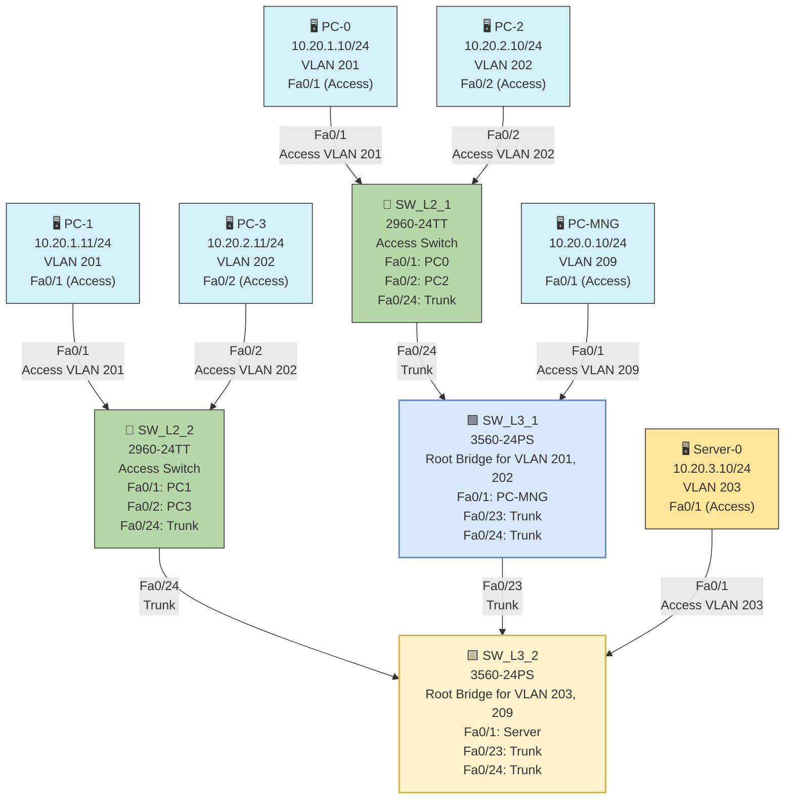

# Part 4: Rapid Per-VLAN Spanning Tree Protocol (RPVST+) Configuration

## Objective
To configure Rapid Per-VLAN Spanning Tree Protocol (RPVST+) on the network, establish priorities for specific VLANs, and verify proper spanning tree operation across the switched network.

## Topology Diagram
Same as Part 3, with the following root bridge assignments:
- SW_L3_1 is root for VLANs 201 (X1) and 202 (X2)
- SW_L3_2 is root for VLANs 203 (X3) and 209 (X9)


## RPVST+ Configuration Table

### VLAN Definition

| VLAN ID | VLAN Name      | Network        | Root Bridge     |
|---------|----------------|----------------|-----------------|
| 209     | MNG            | 10.20.0.0/24   | SW_L3_2         |
| 201     | USER1          | 10.20.1.0/24   | SW_L3_1         |
| 202     | USER2          | 10.20.2.0/24   | SW_L3_1         |
| 203     | SRV            | 10.20.3.0/24   | SW_L3_2         |


### Switch STP Priority Configuration

| Switch   | VLAN          | Priority       | Root Bridge For |
|----------|---------------|----------------|-----------------|
| SW_L3_1  | 201, 202      | 4096           | VLAN 201, 202   |
| SW_L3_2  | 203, 209      | 4096           | VLAN 203, 209   |
| SW_L2_1  | All VLANs     | 32768 (default)| None            |
| SW_L2_2  | All VLANs     | 32768 (default)| None            |

### Trunk Links Configuration

| Switch   | Port   | Connected To | STP State for VLAN 201 | STP State for VLAN 203 |
|----------|--------|-------------|------------------------|------------------------|
| SW_L3_1  | Fa0/23 | SW_L3_2     | Forwarding             | Blocking               |
| SW_L3_1  | Fa0/24 | SW_L2_1     | Forwarding             | Forwarding             |
| SW_L3_2  | Fa0/23 | SW_L3_1     | Blocking               | Forwarding             |
| SW_L3_2  | Fa0/24 | SW_L2_2     | Forwarding             | Forwarding             |
| SW_L2_1  | Fa0/24 | SW_L3_1     | Forwarding             | Forwarding             |
| SW_L2_2  | Fa0/24 | SW_L3_2     | Forwarding             | Forwarding             |

## Instructions

1. **Enable RPVST+ on the Switches**:
   - For each switch, access the CLI through console connection
   - Enter privileged EXEC mode: `enable`
   - Enter global configuration mode: `configure terminal`
   - Enable RPVST+ mode:
     ```
     spanning-tree mode rapid-pvst
     ```

2. **Configure Root Bridge Priorities**:
   - On SW_L3_1 (3560-24PS Switch-1):
     ```
     spanning-tree vlan 201 priority 4096
     spanning-tree vlan 202 priority 4096
     ```
   
   - On SW_L3_2 (3560-24PS Switch-2):
     ```
     spanning-tree vlan 203 priority 4096
     spanning-tree vlan 209 priority 4096
     ```

3. **Configure Trunk Links**:
   - Ensure all trunk links are properly configured (continuing from Part 3):
     - On SW_L3_1:
       ```
       interface fa0/23
       switchport trunk encapsulation dot1q
       switchport mode trunk
       switchport trunk native vlan 209
       no shutdown
       exit
       interface fa0/24
       switchport trunk encapsulation dot1q
       switchport mode trunk
       switchport trunk native vlan 209
       no shutdown
       exit
       ```
     
     - On SW_L3_2:
       ```
       interface fa0/23
       switchport trunk encapsulation dot1q
       switchport mode trunk
       switchport trunk native vlan 209
       no shutdown
       exit
       interface fa0/24
       switchport trunk encapsulation dot1q
       switchport mode trunk
       switchport trunk native vlan 209
       no shutdown
       exit
       ```
     
     - On SW_L2_1 and SW_L2_2:
       ```
       interface fa0/24
       switchport mode trunk
       switchport trunk native vlan 209
       no shutdown
       exit
       ```

4. **Verify Spanning Tree Configuration**:
   - On each switch, verify the spanning tree configuration:
     ```
     show spanning-tree interface
     ```
   
   - Specifically check for:
     ```
     show spanning-tree vlan 201
     show spanning-tree vlan 202
     show spanning-tree vlan 203
     show spanning-tree vlan 209
     ```

## Expected Results

- SW_L3_1 should be the root bridge for VLANs 201 and 202
- SW_L3_2 should be the root bridge for VLANs 203 and 209
- The trunk link between SW_L3_1 and SW_L3_2 should:
  - Be in forwarding state for VLAN 201 on SW_L3_1 and blocking state on SW_L3_2
  - Be in blocking state for VLAN 203 on SW_L3_1 and forwarding state on SW_L3_2
- All other links should be in forwarding state
- No loops should exist in the network topology

## Explanation

This RPVST+ configuration demonstrates several important networking concepts:

1. **Spanning Tree Protocol Purpose**:
   - STP prevents loops in redundant network topologies
   - Without STP, broadcast storms, multiple frame copies, and MAC table instability would occur
   - RPVST+ is Cisco's implementation that allows for faster convergence and per-VLAN configuration

2. **Root Bridge Selection**:
   - The switch with the lowest bridge priority becomes the root bridge
   - Setting a priority of 4096 for specific VLANs ensures those switches become root for those VLANs
   - Different root bridges for different VLANs allows for load balancing

3. **Path Cost and Port States**:
   - STP calculates the best path to the root bridge based on path cost
   - Ports can be in different states: forwarding (active), blocking (standby), or other transitional states
   - In RPVST+, ports can transition faster between states compared to traditional STP

4. **Load Balancing**:
   - Having different root bridges for different VLANs creates natural load balancing
   - Traffic for VLANs 201 and 202 will primarily use one path through the network
   - Traffic for VLANs 203 and 209 will use a different path
   - This maximizes available bandwidth by utilizing all links

5. **Redundancy and Failover**:
   - While some links are in blocking state for certain VLANs, they're immediately available as backups
   - If a primary link fails, RPVST+ quickly transitions the backup link to forwarding state
   - This provides high availability with minimal downtime

6. **Native VLAN Configuration**:
   - Setting VLAN 209 as the native VLAN on trunk ports ensures untagged frames are properly handled
   - This is a security best practice to prevent VLAN hopping attacks

This RPVST+ configuration ensures a loop-free topology while maintaining redundancy and optimizing traffic flow across the network.