# Part 5: EtherChannel LACP Configuration

## Objective
To configure Link Aggregation Control Protocol (LACP) EtherChannel between switches, providing increased bandwidth and redundancy through port aggregation.

## Topology Diagram
Similar to Part 4, but with an EtherChannel between SW_L3_1 and SW_L3_2 using ports Fa0/23 and Fa0/24.

```mermaid
graph TD

%% === PCs ===
    MNG["🖥 PC-MNG<br/>10.X.0.10/24<br/>VLAN X9<br/>Fa0/1 (Access)"]:::pc
    PC0["🖥 PC-0<br/>10.X.1.10/24<br/>VLAN X1<br/>Fa0/1 (Access)"]:::pc
    PC2["🖥 PC-2<br/>10.X.2.10/24<br/>VLAN X2<br/>Fa0/2 (Access)"]:::pc
    PC1["🖥 PC-1<br/>10.X.1.11/24<br/>VLAN X1<br/>Fa0/1 (Access)"]:::pc
    PC3["🖥 PC-3<br/>10.X.2.11/24<br/>VLAN X2<br/>Fa0/2 (Access)"]:::pc

%% === Server ===
    SERVER["🖥 Server-0<br/>10.X.3.100/24<br/>VLAN X3<br/>Fa0/1 (Access)"]:::server

%% === Access Switches ===
    SW3["🔀 SW_L2_1<br/>2960-24TT<br/>Access<br/>Fa0/1: PC0<br/>Fa0/2: PC2<br/>Fa0/24: Trunk"]:::access
    SW4["🔀 SW_L2_2<br/>2960-24TT<br/>Access<br/>Fa0/1: PC1<br/>Fa0/2: PC3<br/>Fa0/24: Trunk"]:::access

%% === Distribution Switches with LACP ===
    SW1["🟩 SW_L3_1<br/>3560-24PS<br/>Port-channel 1: LACP<br/>Fa0/1: PC-MNG<br/>Fa0/23 + Fa0/24 → EtherChannel"]:::etherchannel
    SW2["🟩 SW_L3_2<br/>3560-24PS<br/>Port-channel 1: LACP<br/>Fa0/1: Server<br/>Fa0/23 + Fa0/24 → EtherChannel"]:::etherchannel

%% === Connections ===
    PC0 -->|Fa0/1<br/>Access VLAN X1| SW3
    PC2 -->|Fa0/2<br/>Access VLAN X2| SW3

    PC1 -->|Fa0/1<br/>Access VLAN X1| SW4
    PC3 -->|Fa0/2<br/>Access VLAN X2| SW4

    SW3 -->|Fa0/24<br/>Trunk| SW1
    SW4 -->|Fa0/24<br/>Trunk| SW2

    SW1 -->|Fa0/23 + Fa0/24<br/>LACP EtherChannel<br/>Port-Channel 1| SW2

    MNG -->|Fa0/1<br/>Access VLAN X9| SW1
    SERVER -->|Fa0/1<br/>Access VLAN X3| SW2

%% === Styles ===
    classDef pc fill:#d4f1f9,stroke:#333,stroke-width:1px;
    classDef server fill:#ffe599,stroke:#333,stroke-width:1px;
    classDef access fill:#b6d7a8,stroke:#333,stroke-width:1px;
    classDef etherchannel fill:#d5e8d4,stroke:#82b366,stroke-width:2px;

    class MNG,PC0,PC1,PC2,PC3 pc;
    class SERVER server;
    class SW3,SW4 access;
    class SW1,SW2 etherchannel;

```



## EtherChannel Configuration Table

### EtherChannel Configuration Details

| Parameter | Value | Description |
|-----------|-------|-------------|
| Protocol | LACP (Link Aggregation Control Protocol) | Dynamic negotiation protocol (IEEE 802.3ad) |
| Channel Group | 1 | Identifier for the port channel interface |
| Mode | Active | LACP actively sends negotiation packets |
| Physical Interfaces | Fa0/23, Fa0/24 | Ports that will be bundled into the EtherChannel |
| Logical Interface | Port-channel 1 | Virtual interface representing the bundled links |
| Allowed VLANs | 201-203, 209 (X0, X1, X2, X3, X9) | VLANs permitted on the trunk |
| Encapsulation | dot1q | 802.1Q VLAN tagging protocol |
| Native VLAN | X9 | VLAN for untagged frames |

### Switch Port Configuration

| Switch   | Physical Ports | Channel Group | Mode | Port-Channel |
|----------|---------------|---------------|------|--------------|
| SW_L3_1  | Fa0/23, Fa0/24 | 1 | Active | Port-channel 1 |
| SW_L3_2  | Fa0/23, Fa0/24 | 1 | Active | Port-channel 1 |

### VLAN Configuration

| VLAN ID | VLAN Name | Network | Purpose |
|---------|-----------|---------|---------|
| X0 (20) | Management | 10.X.0.0/24 | Network Management |
| X1 | USERS1 | 10.X.1.0/24 | User Group 1 |
| X2 | USERS2 | 10.X.2.0/24 | User Group 2 |
| X3 | Servers | 10.X.3.0/24 | Server Access |
| X9 | Native | N/A | Native VLAN for trunks |

Note: X represents your variant number (20 in this case).

## Instructions

1. **Shutting Down Existing Ports**:
   - Before configuring EtherChannel, shut down the physical interfaces on SW_L3_1 and SW_L3_2:
     ```
     enable
     configure terminal
     interface range fa0/23 - 24
     shutdown
     exit
     ```

2. **Configuring LACP EtherChannel on SW_L3_1**:
   - Create the port channel and configure LACP:
     ```
     interface range fa0/23 - 24
     channel-protocol lacp
     channel-group 1 mode active
     exit
     ```
   
   - Configure the port-channel interface:
     ```
     interface port-channel 1
     switchport trunk encapsulation dot1q
     switchport mode trunk
     switchport trunk allowed vlan 20,X1,X2,X3,X9
     switchport trunk native vlan X9
     exit
     ```
   
   - Re-enable the physical interfaces:
     ```
     interface range fa0/23 - 24
     no shutdown
     exit
     ```

3. **Configuring LACP EtherChannel on SW_L3_2**:
   - Create the port channel and configure LACP:
     ```
     interface range fa0/23 - 24
     channel-protocol lacp
     channel-group 1 mode active
     exit
     ```
   
   - Configure the port-channel interface:
     ```
     interface port-channel 1
     switchport trunk encapsulation dot1q
     switchport mode trunk
     switchport trunk allowed vlan 20,X1,X2,X3,X9
     switchport trunk native vlan X9
     exit
     ```
   
   - Re-enable the physical interfaces:
     ```
     interface range fa0/23 - 24
     no shutdown
     exit
     ```

4. **Verifying EtherChannel Configuration**:
   - On both switches, verify the EtherChannel configuration:
     ```
     show etherchannel summary
     ```
     This command displays a summary of all EtherChannels on the switch, including their status, protocol, and member ports.
   
   - For more detailed information:
     ```
     show etherchannel detail
     ```
     This command shows detailed information about the EtherChannel, including port state, LACP parameters, and partner information.
   
   - To verify the port-channel interface configuration:
     ```
     show interface port-channel 1
     ```
     This displays the status and configuration of the port-channel interface.

## Expected Results

- The `show etherchannel summary` command should display:
  - Port-channel 1 is up with protocol LACP
  - Both Fa0/23 and Fa0/24 are active members (indicated by 'P' for bundled in port-channel)
  - The EtherChannel is operating in Layer 2 mode

- The `show etherchannel detail` command should show:
  - Both local ports are in LACP mode active
  - Partner ports are detected and synchronized
  - Port states are bundled

- Connectivity tests across the network should succeed:
  - PCs in the same VLAN should be able to ping each other
  - Server should be accessible from Management PC (if routing is configured)

## Explanation

This EtherChannel LACP configuration demonstrates several important networking concepts:

1. **Link Aggregation Benefits**:
   - **Increased Bandwidth**: Multiple physical links are combined into a single logical link, providing greater throughput
   - **Redundancy**: If one link fails, traffic automatically flows through the remaining links without disruption
   - **Load Balancing**: Traffic is distributed across the bundled links using a hash algorithm based on source/destination addresses

2. **LACP Operation**:
   - LACP is a standardized protocol (IEEE 802.3ad) for dynamic link aggregation
   - "Active" mode means the switch actively initiates LACP negotiation by sending LACP packets
   - Both switches must support LACP for the EtherChannel to form properly
   - LACP automatically detects configuration issues and prevents misconfigured ports from being added to the channel

3. **Port Channel Interface**:
   - The port-channel is a virtual interface that represents the aggregated links
   - Configuration applied to the port-channel applies to all member physical interfaces
   - The port-channel interface operates as a single logical link for spanning tree, routing protocols, and other network functions

4. **Trunk Configuration**:
   - The EtherChannel maintains the trunk configuration, carrying multiple VLANs
   - Native VLAN configuration ensures proper handling of untagged frames
   - Allowed VLAN list controls which VLANs can traverse the EtherChannel

5. **Best Practices**:
   - Shutting down interfaces before configuration prevents spanning tree issues
   - Identical configuration on all member ports is required for proper operation
   - Consistent configuration on both sides of the EtherChannel is essential

This EtherChannel configuration enhances the network's performance and resilience by providing increased bandwidth and redundancy between the core switches (SW_L3_1 and SW_L3_2).