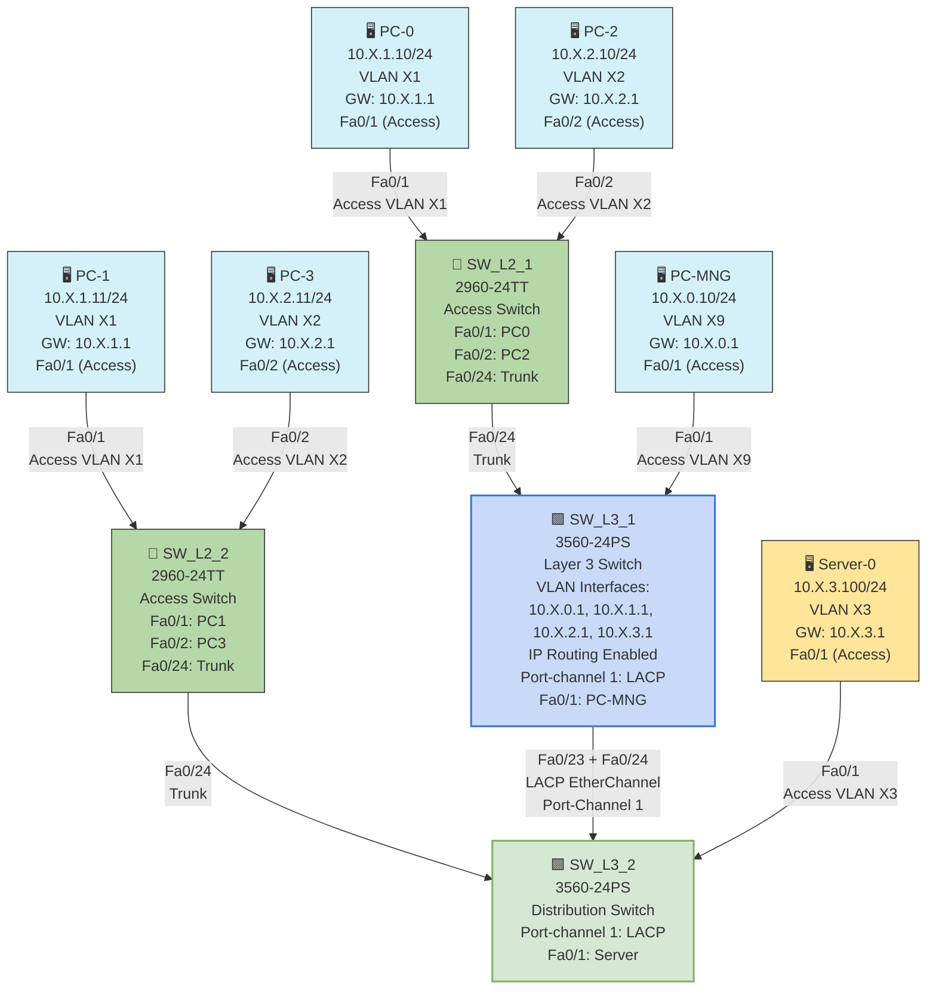

# Part 6: Inter-VLAN Routing Configuration

## Objective
To configure inter-VLAN routing using a Layer 3 switch (Router-on-a-Stick method), establish management interfaces, enable connectivity between different VLANs, and configure default gateways on all devices.

## Topology Diagram
Similar to Part 5, with Layer 3 routing capabilities enabled on SW_L3_1 and proper default gateway configurations on all devices.


## IP Addressing and Routing Table

### Layer 3 Switch Interface Configuration (SW_L3_1)

| Interface        | IP Address/Mask   | VLAN       | Description          |
|------------------|-------------------|------------|----------------------|
| VLAN X9 (20)     | 10.X.0.1/24       | X9         | Management Interface |
| VLAN X1          | 10.X.1.1/24       | X1         | USERS1 Gateway       |
| VLAN X2          | 10.X.2.1/24       | X2         | USERS2 Gateway       |
| VLAN X3          | 10.X.3.1/24       | X3         | Servers Gateway      |

### Layer 3 Switch Interface Configuration (SW_L3_2)

| Interface        | IP Address/Mask   | VLAN       | Description          |
|------------------|-------------------|------------|----------------------|
| VLAN X9 (20)     | 10.X.0.3/24       | X9         | Management Interface |

### Layer 2 Switch Management Interface Configuration

| Switch          | Interface         | IP Address/Mask   | Default Gateway | VLAN |
|-----------------|-------------------|-------------------|-----------------|------|
| SW_L2_1         | VLAN X9           | 10.X.0.4/24       | 10.X.0.1        | X9   |
| SW_L2_2         | VLAN X9           | 10.X.0.5/24       | 10.X.0.1        | X9   |

### End Device Configuration

| Device          | IP Address/Mask   | Default Gateway | VLAN |
|-----------------|-------------------|-----------------|------|
| Management PC   | 10.X.0.10/24      | 10.X.0.1        | X9   |
| PC-0            | 10.X.1.10/24      | 10.X.1.1        | X1   |
| PC-1            | 10.X.1.11/24      | 10.X.1.1        | X1   |
| PC-2            | 10.X.2.10/24      | 10.X.2.1        | X2   |
| PC-3            | 10.X.2.11/24      | 10.X.2.1        | X2   |
| Server-0        | 10.X.3.100/24     | 10.X.3.1        | X3   |

Note: X represents your variant number (20 in this case).

## Instructions

1. **Enable IP Routing on SW_L3_1**:
   - Connect to SW_L3_1 via console
   - Enter privileged EXEC mode and then configuration mode:
     ```
     enable
     configure terminal
     ```
   - Enable IP routing:
     ```
     ip routing
     ```

2. **Configure SVI (Switched Virtual Interface) on SW_L3_1**:
   - Create and configure VLAN interfaces for each VLAN:
     ```
     interface vlan X9
     ip address 10.X.0.1 255.255.255.0
     description Management_VLAN
     no shutdown
     exit
     
     interface vlan X1
     ip address 10.X.1.1 255.255.255.0
     description USERS1_VLAN
     no shutdown
     exit
     
     interface vlan X2
     ip address 10.X.2.1 255.255.255.0
     description USERS2_VLAN
     no shutdown
     exit
     
     interface vlan X3
     ip address 10.X.3.1 255.255.255.0
     description Servers_VLAN
     no shutdown
     exit
     ```

3. **Configure Management Interface on SW_L3_2**:
   - Connect to SW_L3_2 via console
   - Enter configuration mode:
     ```
     enable
     configure terminal
     ```
   - Create and configure management VLAN interface:
     ```
     interface vlan X9
     ip address 10.X.0.3 255.255.255.0
     description Management_VLAN
     no shutdown
     exit
     ```
   - Configure default gateway pointing to SW_L3_1:
     ```
     ip default-gateway 10.X.0.1
     ```

4. **Configure Management Interface on Layer 2 Switches**:
   - For SW_L2_1 (2960-24TT):
     ```
     enable
     configure terminal
     interface vlan X9
     ip address 10.X.0.4 255.255.255.0
     no shutdown
     exit
     ip default-gateway 10.X.0.1
     exit
     ```
   
   - For SW_L2_2 (2960-24TT):
     ```
     enable
     configure terminal
     interface vlan X9
     ip address 10.X.0.5 255.255.255.0
     no shutdown
     exit
     ip default-gateway 10.X.0.1
     exit
     ```

5. **Configure End Devices**:
   - For each PC, set the appropriate IP address, subnet mask, and default gateway according to the IP Configuration Table
   - For the Server, set IP address 10.X.3.100, subnet mask 255.255.255.0, and default gateway 10.X.3.1

6. **Configure User Authentication on SW_L3_1**:
   - Setup local username and privilege level:
     ```
     enable
     configure terminal
     username cisco privilege 15 password cisco
     enable password enable
     line vty 0 15
     login local
     exit
     ```

7. **Verify Configuration**:
   - Verify routing is enabled on SW_L3_1:
     ```
     show ip route
     ```
   
   - Test connectivity between VLANs:
     ```
     ping 10.X.0.10    # Ping from SW_L3_1 to Management PC
     ping 10.X.1.10    # Ping from SW_L3_1 to PC-0
     ping 10.X.2.10    # Ping from SW_L3_1 to PC-2
     ping 10.X.3.100   # Ping from SW_L3_1 to Server-0
     ```
   
   - Test connectivity using traceroute to see routing path:
     ```
     traceroute 10.X.3.100
     ```

## Expected Results

- The `show ip route` command on SW_L3_1 should display directly connected routes for all configured VLANs
- Pings between devices in different VLANs should succeed
- Traceroute from a PC to a device in another VLAN should show SW_L3_1 as the first hop
- All switches should be manageable from the Management PC

## Explanation

This inter-VLAN routing configuration demonstrates several important networking concepts:

1. **Router-on-a-Stick Architecture**:
   - A Layer 3 switch (SW_L3_1) acts as the central router for all VLANs
   - Switched Virtual Interfaces (SVIs) serve as gateways for each VLAN
   - This eliminates the need for an external router while maintaining VLAN segregation

2. **Layer 2 vs. Layer 3 Switching**:
   - Layer 2 switches (SW_L2_1, SW_L2_2) operate at the Data Link Layer, forwarding frames based on MAC addresses
   - Layer 3 switches (SW_L3_1) also operate at the Network Layer, routing packets between VLANs based on IP addresses
   - This hierarchical design follows the core-distribution-access model

3. **Default Gateway Configuration**:
   - All devices require a default gateway to communicate outside their local subnet
   - End devices point to the SVI IP address on SW_L3_1 as their gateway
   - Layer 2 switches also need a default gateway for their management traffic

4. **Out-of-Band Management**:
   - A dedicated management VLAN (X9) provides secure administrative access
   - All network devices have an interface in this VLAN
   - This separates management traffic from user data

5. **Network Segmentation Benefits**:
   - Security: Traffic is isolated between VLANs and can be controlled through access lists
   - Performance: Broadcast domains are reduced to each VLAN
   - Organization: Networks are logically grouped by function (management, users, servers)

6. **Centralized Routing**:
   - All inter-VLAN traffic passes through SW_L3_1
   - This provides a single point for implementing security policies
   - Routing tables are simplified with direct connections to all VLANs

This final part of the lab completes the network infrastructure by enabling communication between the previously isolated VLANs, creating a fully functional and segmented network.