# Part 6: Inter-VLAN Routing Configuration

## Objective
To configure inter-VLAN routing using a Layer 3 switch, establish management interfaces, enable connectivity between different VLANs, and configure default gateways on all devices.

## Topology Diagram
Building on Part 5, with Layer 3 routing capabilities enabled on SW_L3_1 and proper default gateway configurations on all devices.

```mermaid
graph TD

%% === PCs ===
    MNG["🖥 PC-MNG<br/>10.20.0.10/24<br/>VLAN 209<br/>GW: 10.20.0.1<br/>Fa0/1 (Access)"]:::pc
    PC0["🖥 PC-0<br/>10.20.1.10/24<br/>VLAN 201<br/>GW: 10.20.1.1<br/>Fa0/1 (Access)"]:::pc
    PC2["🖥 PC-2<br/>10.20.2.10/24<br/>VLAN 202<br/>GW: 10.20.2.1<br/>Fa0/2 (Access)"]:::pc
    PC1["🖥 PC-1<br/>10.20.1.11/24<br/>VLAN 201<br/>GW: 10.20.1.1<br/>Fa0/1 (Access)"]:::pc
    PC3["🖥 PC-3<br/>10.20.2.11/24<br/>VLAN 202<br/>GW: 10.20.2.1<br/>Fa0/2 (Access)"]:::pc

%% === Server ===
    SERVER["🖥 Server-0<br/>10.20.3.100/24<br/>VLAN 203<br/>GW: 10.20.3.1<br/>Fa0/1 (Access)"]:::server

%% === Access Switches ===
    SW3["🔀 SW_L2_1<br/>2960-24TT<br/>10.20.0.4/24<br/>GW: 10.20.0.1<br/>Fa0/1: PC0<br/>Fa0/2: PC2<br/>Fa0/24: Trunk"]:::access
    SW4["🔀 SW_L2_2<br/>2960-24TT<br/>10.20.0.5/24<br/>GW: 10.20.0.1<br/>Fa0/1: PC1<br/>Fa0/2: PC3<br/>Fa0/24: Trunk"]:::access

%% === Layer 3 Switches with Routing ===
    SW1["🟩 SW_L3_1<br/>3560-24PS<br/>Layer 3 Switch<br/>VLAN Interfaces:<br/>10.20.0.1/24 (209)<br/>10.20.1.1/24 (201)<br/>10.20.2.1/24 (202)<br/>10.20.3.1/24 (203)<br/>IP Routing Enabled"]:::l3
    SW2["🟩 SW_L3_2<br/>3560-24PS<br/>10.20.0.3/24<br/>GW: 10.20.0.1<br/>Fa0/1: Server"]:::distribution

%% === Connections ===
    PC0 -->|Fa0/1<br/>Access VLAN 201| SW3
    PC2 -->|Fa0/2<br/>Access VLAN 202| SW3

    PC1 -->|Fa0/1<br/>Access VLAN 201| SW4
    PC3 -->|Fa0/2<br/>Access VLAN 202| SW4

    SW3 -->|Fa0/24<br/>Trunk| SW1
    SW4 -->|Fa0/24<br/>Trunk| SW2

    SW1 -->|Fa0/23<br/>Trunk| SW2

    MNG -->|Fa0/1<br/>Access VLAN 209| SW1
    SERVER -->|Fa0/1<br/>Access VLAN 203| SW2

%% === Styles ===
    classDef pc fill:#d4f1f9,stroke:#333,stroke-width:1px;
    classDef server fill:#ffe599,stroke:#333,stroke-width:1px;
    classDef access fill:#b6d7a8,stroke:#333,stroke-width:1px;
    classDef distribution fill:#d5e8d4,stroke:#82b366,stroke-width:2px;
    classDef l3 fill:#c9daf8,stroke:#3c78d8,stroke-width:2px;

    class MNG,PC0,PC1,PC2,PC3 pc;
    class SERVER server;
    class SW3,SW4 access;
    class SW1 l3;
    class SW2 distribution;

```


## IP Addressing and Routing Table

### Layer 3 Switch Interface Configuration (SW_L3_1)

| Interface        | IP Address/Mask   | VLAN       | Description          |
|------------------|-------------------|------------|----------------------|
| VLAN 209         | 10.20.0.1/24      | 209        | Management Interface |
| VLAN 201         | 10.20.1.1/24      | 201        | USER1 Gateway        |
| VLAN 202         | 10.20.2.1/24      | 202        | USER2 Gateway        |
| VLAN 203         | 10.20.3.1/24      | 203        | SRV Gateway          |

### Layer 3 Switch Interface Configuration (SW_L3_2)

| Interface        | IP Address/Mask   | VLAN       | Description          |
|------------------|-------------------|------------|----------------------|
| VLAN 209         | 10.20.0.3/24      | 209        | Management Interface |

### Layer 2 Switch Management Interface Configuration

| Switch          | Interface         | IP Address/Mask   | Default Gateway | VLAN |
|-----------------|-------------------|-------------------|-----------------|------|
| SW_L2_1         | VLAN 209          | 10.20.0.4/24      | 10.20.0.1       | 209  |
| SW_L2_2         | VLAN 209          | 10.20.0.5/24      | 10.20.0.1       | 209  |

### End Device Configuration

| Device          | IP Address/Mask   | Default Gateway | VLAN |
|-----------------|-------------------|-----------------|------|
| Management PC   | 10.20.0.10/24     | 10.20.0.1       | 209  |
| PC-0            | 10.20.1.10/24     | 10.20.1.1       | 201  |
| PC-1            | 10.20.1.11/24     | 10.20.1.1       | 201  |
| PC-2            | 10.20.2.10/24     | 10.20.2.1       | 202  |
| PC-3            | 10.20.2.11/24     | 10.20.2.1       | 202  |
| Server-0        | 10.20.3.100/24    | 10.20.3.1       | 203  |

## Instructions

1. **Enable IP Routing on SW_L3_1**:
   - Connect to SW_L3_1 via console
   - Enter privileged EXEC mode and then configuration mode:
     ```
     enable
     configure terminal
     ```
   - Enable IP routing:
     ```
     ip routing
     ```

2. **Configure SVI (Switched Virtual Interface) on SW_L3_1**:
   - Create and configure VLAN interfaces for each VLAN:
     ```
     interface vlan 209
     ip address 10.20.0.1 255.255.255.0
     no shutdown
     exit
     
     interface vlan 201
     ip address 10.20.1.1 255.255.255.0
     no shutdown
     exit
     
     interface vlan 202
     ip address 10.20.2.1 255.255.255.0
     no shutdown
     exit
     
     interface vlan 203
     ip address 10.20.3.1 255.255.255.0
     no shutdown
     exit
     ```

3. **Configure Management Interface on SW_L3_2**:
   - Connect to SW_L3_2 via console
   - Enter configuration mode:
     ```
     enable
     configure terminal
     ```
   - Create and configure management VLAN interface:
     ```
     interface vlan 209
     ip address 10.20.0.3 255.255.255.0
     no shutdown
     exit
     ```
   - Configure default gateway pointing to SW_L3_1:
     ```
     ip default-gateway 10.20.0.1
     ```

4. **Configure Management Interface on Layer 2 Switches**:
   - For SW_L2_1 (2960-24TT):
     ```
     enable
     configure terminal
     interface vlan 209
     ip address 10.20.0.4 255.255.255.0
     no shutdown
     exit
     ip default-gateway 10.20.0.1
     exit
     ```
   
   - For SW_L2_2 (2960-24TT):
     ```
     enable
     configure terminal
     interface vlan 209
     ip address 10.20.0.5 255.255.255.0
     no shutdown
     exit
     ip default-gateway 10.20.0.1
     exit
     ```

5. **Configure End Devices**:
   - Management PC:
     - IP address: 10.20.0.10
     - Subnet mask: 255.255.255.0
     - Default gateway: 10.20.0.1

   - PC-0:
     - IP address: 10.20.1.10
     - Subnet mask: 255.255.255.0
     - Default gateway: 10.20.1.1

   - PC-1:
     - IP address: 10.20.1.11
     - Subnet mask: 255.255.255.0
     - Default gateway: 10.20.1.1

   - PC-2:
     - IP address: 10.20.2.10
     - Subnet mask: 255.255.255.0
     - Default gateway: 10.20.2.1

   - PC-3:
     - IP address: 10.20.2.11
     - Subnet mask: 255.255.255.0
     - Default gateway: 10.20.2.1

   - Server-0:
     - IP address: 10.20.3.100
     - Subnet mask: 255.255.255.0
     - Default gateway: 10.20.3.1

6. **Configure User Authentication on SW_L3_1**:
   - Setup local username and privilege level:
     ```
     enable
     configure terminal
     username cisco privilege 15 password cisco
     enable password enable
     line vty 0 15
     login local
     exit
     ```

7. **Verify Configuration**:
   - Verify routing is enabled on SW_L3_1:
     ```
     show ip route
     ```
   
   - Test connectivity between VLANs:
     ```
     ping 10.20.0.10    # Ping from SW_L3_1 to Management PC
     ping 10.20.1.10    # Ping from SW_L3_1 to PC-0
     ping 10.20.2.10    # Ping from SW_L3_1 to PC-2
     ping 10.20.3.100   # Ping from SW_L3_1 to Server-0
     ```
   
   - Test connectivity using traceroute to see routing path:
     ```
     traceroute 10.20.3.100
     ```

## Expected Results

- The `show ip route` command on SW_L3_1 should display directly connected routes for all configured VLANs
- Pings between devices in different VLANs should succeed
- Traceroute from a PC to a device in another VLAN should show SW_L3_1 as the first hop
- All switches should be manageable from the Management PC

## Explanation

This inter-VLAN routing configuration demonstrates several important networking concepts:

1. **Layer 3 Switch Routing**:
   - SW_L3_1 acts as the central router for all VLANs
   - Switched Virtual Interfaces (SVIs) serve as gateways for each VLAN
   - This eliminates the need for an external router while maintaining VLAN segregation

2. **Layer 2 vs. Layer 3 Switching**:
   - Layer 2 switches (SW_L2_1, SW_L2_2) operate at the Data Link Layer, forwarding frames based on MAC addresses
   - Layer 3 switches (SW_L3_1) also operate at the Network Layer, routing packets between VLANs based on IP addresses
   - This hierarchical design follows the core-distribution-access model

3. **Default Gateway Configuration**:
   - All devices require a default gateway to communicate outside their local subnet
   - End devices point to the SVI IP address on SW_L3_1 as their gateway
   - Layer 2 switches also need a default gateway for their management traffic

4. **Management Network**:
   - A dedicated management VLAN (209) provides secure administrative access
   - All network devices have an interface in this VLAN
   - This separates management traffic from user data

5. **Network Segmentation Benefits**:
   - Security: Traffic is isolated between VLANs and can be controlled through access lists
   - Performance: Broadcast domains are reduced to each VLAN
   - Organization: Networks are logically grouped by function (management, users, servers)

6. **Centralized Routing**:
   - All inter-VLAN traffic passes through SW_L3_1
   - This provides a single point for implementing security policies
   - Routing tables are simplified with direct connections to all VLANs

This final part of the lab completes the network infrastructure by enabling communication between the previously isolated VLANs, creating a fully functional and segmented network.