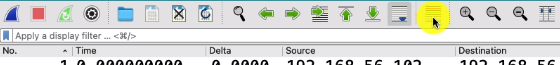
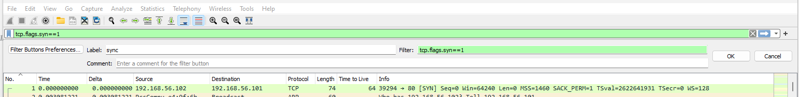
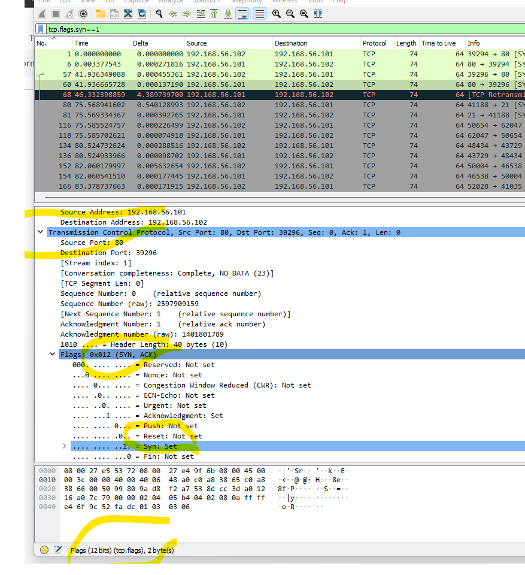
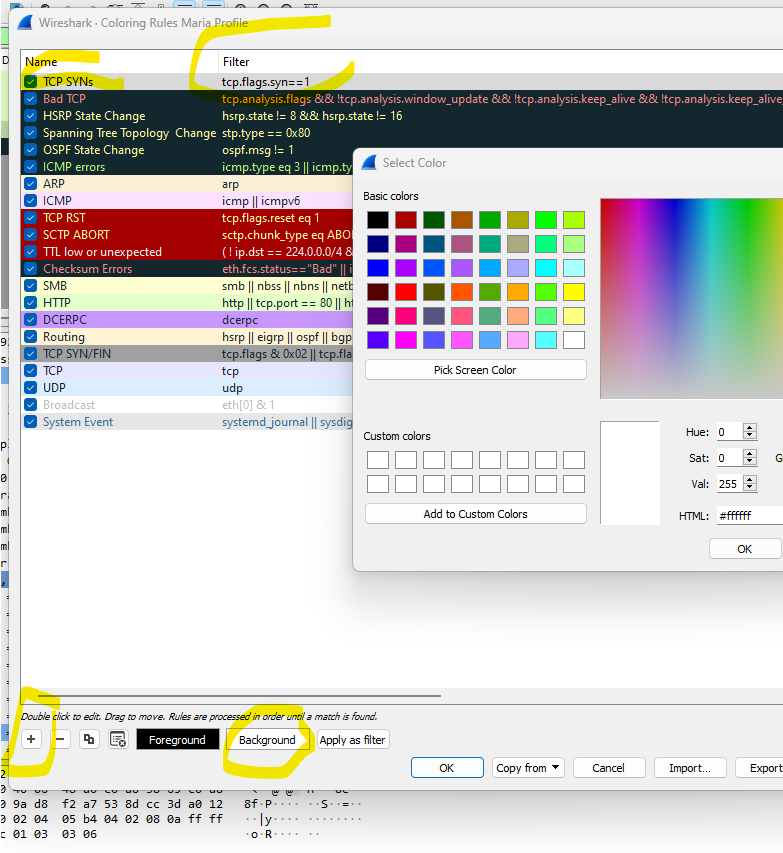
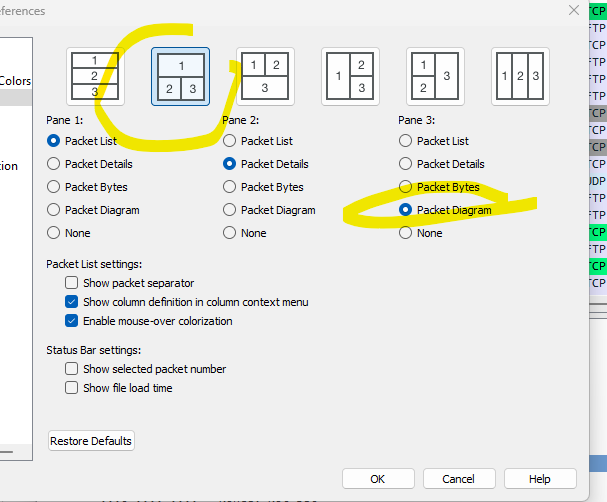

# Lab 1 - Introduction to Wireshark Interface

## Profile Setup
Profile: default, if you click on it → you can build your own (new profile). Create one with your name.

## Correct the Time Column
Go to View → Time Display Format and select "Seconds Since Previous Displayed Packet"

## Add Delta Column
Edit → Preferences → Add column Delta (Choose Type "Delta time" from the dropdown)

If we want to see TTL to every packet (Time to Live: 64)(check IP protocol) → we need a separate column. Find this attribute → right click → apply as column

## Coloring Traffic
You can switch off coloring traffic by clicking the colored bar button in the toolbar:

## Custom Coloring Rules
You can color traffic you need: add filter "tcp.flags.syn==1" in the filter bar. Then click the "+" button to save it with a label.

## Search With Your Filter

Copy tcp.flags.syn==1 and go to: View → Coloring Rules (you can see a lot of defaults) → Create new coloring rules

Pull "Bad TCP" rules UP, it's more important!
Remove the filter from the filter bar, on the right you can scroll and still see your filter in action.

## Adjusting the Screen Layout
Open any packet, #252 for example. In details, on the right still a lot of free space. Go to Preferences → Appearance → Layout. Make changes:

## Lab Questions

**Download the PCAP file and try to answer the following questions. Some questions are easier to find, and some might take some research.**

1. **How many packets were captured in this trace file?***
   
   *Hint: Look at the status bar at the bottom of the Wireshark window. It shows the total number of packets in the current capture.*

2. **What protocol does packet number 8 contain? (The highest-layer protocol)***
   
   *Hint: Click on packet #8 in the packet list, then look at the topmost protocol in the packet details pane.*

3. **If you just installed Wireshark for the first time, what is the name of the profile you are using? (bottom right corner)**
   
   *Hint: Look at the very bottom right corner of your Wireshark window where the profile name is displayed.*

4. **Look at packet number one:**
   * **What is the source IP address in this packet?***
     
     *Hint: Look in the packet details pane under Internet Protocol. The source address is clearly labeled.*
   
   * **What is the source TCP port in this same packet?***
     
     *Hint: Expand the TCP section in the packet details. Port numbers in TCP are critical for identifying which application or service is communicating.*
   
   * **What TCP flag is set in this packet?***
     
     *Hint: In the TCP section, look for the "Flags" field. TCP flags determine the purpose and state of a connection.*

5. **What is the frame number of the next packet in this TCP conversation?***
   
   *Hint: Look for packets with the same IP addresses and ports, but in the reverse direction (where the original destination becomes the source).*

6. **Can you set a filter for this TCP conversation? How many packets do you get?***
   
   *Hint: Try using a filter like: `ip.addr==192.168.X.X and ip.addr==192.168.Y.Y and tcp.port==PORT1 and tcp.port==PORT2`
   (Replace X.X, Y.Y, PORT1, and PORT2 with the actual values you found in the previous questions)*