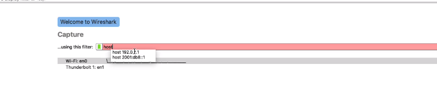

# Lab 2 -  Filtering Traffic in Wireshark

## 🔍 Need Help with Wireshark Display Filters?

If you're working with Wireshark and need to fine-tune your packet captures, understanding **Display Filters** is essential.

- 📘 [Wireshark Display Filters documentation](https://www.wireshark.org/docs/wsug_html_chunked/ChWorkDisplayFilterSection.html)  
  *Official guide from the Wireshark User’s Guide with examples and filter syntax.*

- 🌐 [Wireshark DisplayFilters Wiki](https://wiki.wireshark.org/DisplayFilters)  
  *Community-maintained resource with tips, use cases, and advanced filtering examples.*

**1. Download the PCAP file**

**2. Now that you know the basics, see if you can make a few more adjustments on your own.**

**Task 1: Add a coloring rule that will make your tcp FIN packets blue. What filter will you use to do that?**
*1 point*

*Hint: Look at the "Common Filters" image above. You'll need to use tcp.flags.fin and set it to the right value. Remember that View → Coloring Rules is where you add new coloring rules.*

Capture Filters vs Display Filters (For Capture, it's easier to pull all packets at first)

**Task 2: Select packet number 1. Can you find the TCP segment length? Add this value as a column. Enter "done" in the answer field below when finished.**
*1 point*

*Hint: Click on packet #1, expand the TCP section in the middle pane, and look for "TCP Segment Len". Right-click this field and look for an option to add it as a column.*

Filtering for IP Addresses, Source or Destination

ip.addr  
ip.src  
ip.dst  

To search for traffic coming from/to specific subnet:   

Go to Statistics - Endpoints - it will show only subnet traffic  

**Task 3: It would be nice to have a button that quickly filters for all TCP Errors. See if you can find the TCP Retransmission. How can you filter for all TCP errors in the trace file? What is this filter?**
*1 point*

*Hint: TCP errors include retransmissions, duplicate ACKs, and more. Look for a common field that all TCP analysis flags share. Try typing "tcp.analysis" in the filter box and see what auto-complete suggests.*

Filtering for Protocols and Port Numbers
Analyze -> Display Filters  

**Task 4: Add the TCP Errors filter as a button in this profile. Enter "done" below when finished.**
*1 point*

*Hint: Right-click in the filter toolbar area to create a new button. Use the filter you found in Task 3 as the filter string for this button.*

Only packets with payload:  

Filtering for Conversations: Right click on first packet

Conversation filter: TCP  

Statistics - Conversations, you can see that it's 28 TCP conversations  

**Task 5: It can be a little overkill to see timestamps all the way to the nanosecond. Using the View | Time Display Format menu option, can you see how to configure Wireshark to only display to the microsecond? Make this change in this profile and type "done" below.**
*1 point*

*Hint: In the View menu, look at the Time Display Format options. You want to show timestamps with microsecond precision instead of nanosecond precision.*

Operators in Display Filters  

Using Operators when Filtering Traffic  

NB! Export Specified Packets (packet range)
Special Operators - Contains, Matches

How to answer the question: "How many frames has word admin"

To find how many frames contain the word "admin":

1. Enter this filter in the display filter box: `frame contains "admin"`

2. Press Enter or click Apply

3. Look at the status bar at the bottom of Wireshark which will show how many packets matched the filter, or count the packets in the display.

*You could also use variations like:*
- `frame contains "admin" and http` *(only HTTP packets containing "admin")*
- `frame contains "admin" and ip.addr == 192.168.56.101` *(only packets from this IP containing "admin")*

## Additional Tips for Lab 2

1. For coloring rules, make sure to set both the foreground (text) and background colors
2. When adding a column, you can drag it to reposition it in the column list
3. Filter buttons are saved with your profile and will be available in future sessions
4. The TCP errors filter will show all packets that have any analysis flags set by Wireshark
5. For timestamp display, look for options about precision in the Time Display Format menu 