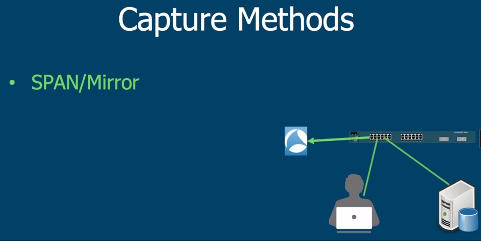

# Lab 3: Network Packet Capture and Analysis

## Pre-lab Preparation

Before starting the lab exercises, make sure you have:
- Wireshark installed on your system
- Downloaded the lab PCAP file from the course repository
- Basic familiarity with the OSI and TCP/IP models

## Part 1: Where and How to Capture Packets

### Key Considerations for Packet Capture

Before starting a capture, consider these important questions:

When planning to capture network traffic, always ask yourself:
- **Who is impacted?** - Which users or systems will be affected by your capture
- **All the time?** - Do you need continuous monitoring or just during specific times?
- **What applications?** - Which protocols or applications need to be monitored

### Theory: Selecting the Right Capture Method

The location where you capture packets significantly impacts what you'll see and the quality of your analysis. Let's explore three primary methods:

#### Method 1: Direct Capture on Machine Under Test

Capturing directly on the machine being analyzed is the simplest approach.

**Pros:**
- Easy to set up
- Captures exactly what the host sees
- No additional hardware required

**Cons:**
- Impacts performance of the host
- May miss packets dropped by NIC
- Cannot see physical layer issues

**When to use:** Best for simple troubleshooting when you need to see exactly what a specific host is receiving/sending and don't need to analyze physical layer issues.

#### Method 2: SPAN/Mirror Port

Switch Port Analyzer (SPAN) or port mirroring copies traffic from one or more ports to a monitoring port.

**Key Points:**
- Avoids performance impact on the system under test
- Uses analysis ports on network switches
- "100 ports to 1 monitoring port? No point to send" - can lead to packet loss
- "We use analysis ports" - dedicated monitoring interfaces

**When to use:** Good for monitoring traffic without affecting the target systems, but be careful about oversubscription when mirroring multiple high-traffic ports.

#### Method 3: Capture from Both Ends

For comprehensive analysis, it's often valuable to capture at multiple points in the network path.

**Benefits:**
- "Better form more than 1 location"
- Provides visibility into how packets change as they traverse the network
- Helps identify where packet loss occurs
- Better for understanding end-to-end communication issues

**When to use:** Ideal for troubleshooting complex network issues, especially when you suspect packet loss or modification between endpoints.

## Part 2: Long Term Capture Configuration

For capturing over extended periods to identify intermittent issues:

### Ring Buffer Configuration

A ring buffer allows continuous capture while managing file size:
- "Ring Buffer - tükkelab" (circular buffer that overwrites oldest data)
- Capture to a permanent file with specified parameters
- Create new files automatically based on various conditions

**Wireshark Ring Buffer Settings:**
- Output format: pcapng or pcap
- Create a new file automatically after:
  - A specified number of packets (e.g., 100000)
  - A specified file size (e.g., 500 MB)
  - A specified time interval (e.g., 1 hour)
- Use a ring buffer with a specified number of files (e.g., 100)

**Command Line Alternatives:**
- "Veel olemas Dumpcap, Ring-Buffer on the CLI" - These capabilities are also available in command-line tools

**Exercise:** Configure Wireshark to capture packets with a ring buffer that:
1. Creates a new file every 100 MB
2. Maintains a maximum of 5 files
3. Uses pcapng format
4. Captures on your primary network interface

## Part 3: The Anatomy of a Packet

### OSI vs TCP/IP Model

The OSI (Open Systems Interconnection) model consists of 7 layers, while the TCP/IP model simplifies this into 4 layers. Understanding these models helps you analyze network traffic at different abstraction levels.

**Key Points to Remember:**
- Physical and Data Link layers in OSI map to Network Interface in TCP/IP
- Network layer maps to Internet layer
- Transport layer remains the same in both models
- Session, Presentation, and Application layers in OSI map to Application layer in TCP/IP

### Ethernet Frame Structure

At the Data Link layer, Ethernet frames have the following structure:
- Destination MAC (D)
- Source MAC (S)
- Type field (2 bytes) - Indicates the Network Layer Protocol
- Data payload (46-1500 bytes)
- Frame Check Sequence (FCS) for error detection

**Important:** The Ethertype field (2 bytes) tells us which Network Layer protocol is encapsulated in the frame. Common values include:
- 0x0800: IPv4
- 0x0806: ARP
- 0x86DD: IPv6

### Analyzing Packets in Wireshark

Check-out 1.package in Wireshark

Wireshark displays captured packets with:
- Summary information in the packet list
- Detailed protocol information in the middle pane
- Raw hex data in the bottom pane

The image shows:
- Frame details captured on wire (2088 bits)
- Ethernet II header with source and destination MAC addresses
- IPv4 packet with source and destination IP addresses
- TLSv1.2 protocol information
- "segments -> frames->packets" - showing the relationship between different encapsulation units

### Filtering and Analyzing in Wireshark

Wireshark provides powerful filtering capabilities:
- Apply display filters to isolate specific traffic
- Expand protocol details to examine headers
- Right-click menus for additional analysis options
- How to select traffic that is not IPv4

**Exercise:** Practice creating and applying these Wireshark filters:
1. `ip.addr == 192.168.1.1` (Traffic to/from a specific IP)
2. `http or dns` (HTTP or DNS traffic)
3. `!(ip.addr == 192.168.1.1)` (Traffic NOT involving a specific IP)
4. `tcp.port == 443` (HTTPS traffic)

## Part 4: Understanding Packet Types

### Unicasts vs Broadcasts vs Multicasts

Different communication patterns are represented by different destination addresses:

**Broadcast:**
- Top panel shows Frame 16 with destination "Broadcast (ff:ff:ff:ff:ff:ff)"
- Used for one-to-all communication
- LG bit = Locally administered address
- IG bit = Group address (multicast/broadcast)

**Multicast:**
- Bottom panel shows Frame 15 with destination "IPv6mcast_fb (33:33:00:00:00:fb)"
- Used for one-to-many communication
- IPv6 multicast addresses begin with 33:33

**Unicast:**
- One-to-one communication between two specific hosts
- Uses specific MAC and IP addresses for both source and destination

**Exercise:** In your Wireshark capture:
1. Filter for broadcast packets using `eth.dst == ff:ff:ff:ff:ff:ff`
2. Filter for IPv6 multicast using `ipv6.dst.is_multicast == 1`
3. Count how many of each type appear in your capture

## Part 5: Network Layer - IP Protocol

### IP Header Structure

The IP header contains:
- Version and Header Length (1 byte)
- Differentiated Services Field
- Total Length
- ID, Flags, Fragment Offset
- TTL (Time to Live)
- Protocol ID
- Header Checksum
- Source IP Address (4 bytes)
- Destination IP Address (4 bytes)
- Data payload

**Key Fields for Analysis:**
- **TTL (Time to Live):** Decrements at each router hop; prevents infinite routing loops
- **Protocol ID:** Identifies the Transport layer protocol (6=TCP, 17=UDP)
- **Flags:** Control fragmentation (Don't Fragment, More Fragments)
- **Fragment Offset:** Position of this fragment in the original datagram

## Part 6: Following Packets Through the Network

### Packet Analysis Example from Lab 1 file

Example packet analysis showing:
- Frame 1: 74 bytes on wire
- Ethernet II header
- IPv4 packet details:
  - Version: 4
  - Header Length: 20 bytes
  - Differentiated Services: 0x00
  - Total Length: 60
  - Identification: 0x79ff (31231)
  - Flags: Don't fragment
  - Time to Live: 64
  - Protocol: TCP (6)
  - Source Address: 192.168.56.102
  - Destination Address: 192.168.56.101

### Re-encapsulation Process

As packets travel through networks, they are encapsulated and de-encapsulated:

- "Ethernet: point to point" - Layer 2 connections are point-to-point
- "IP: end to end" - Layer 3 provides end-to-end connectivity

The diagrams illustrate how:
1. Original packet with source/destination information
2. Packet traversing through multiple network segments
3. Headers being modified at each hop while preserving the IP information
4. Re-encapsulation process at each network boundary

**Key Concept:** While the Ethernet header (Layer 2) changes at each hop, the IP header (Layer 3) remains largely unchanged from source to destination. This enables end-to-end communication across different network segments.

## Lab Exercise: Packet Analysis with Wireshark

### Setup

1. Download the provided PCAP file
2. Open the file with Wireshark
3. Familiarize yourself with the Wireshark interface:
   - Packet list pane (top)
   - Packet details pane (middle)
   - Packet bytes pane (bottom)

### Tasks and Questions

Complete the following analysis tasks and answer the questions:

#### 1. Basic Protocol Analysis

**Question:** How many DNS packets are in the trace file?

**Hint:** 
- Use the display filter: `dns`
- Count the number of packets that match this filter
- DNS typically uses UDP port 53, but the protocol itself is what we're filtering for
- Remember that DNS packets will have "Domain Name System" in the protocol column or details

#### 2. HTTP Traffic Analysis

**Question:** How many HTTP packets are in the pcap?

**Hint:**
- Use the display filter: `http`
- HTTP uses TCP port 80
- Look for packets with HTTP protocol shown in the protocol column
- Note that HTTP packets include requests and responses

#### 3. TCP Port Filtering

**Question:** Set a filter for TCP port 80. How many packets meet that filter?

**Hint:**
- Use the display filter: `tcp.port == 80`
- This captures both source and destination port 80
- This will include all TCP packets using port 80, not just HTTP protocol packets
- Alternative filters: `tcp.srcport == 80 or tcp.dstport == 80`

#### 4. TCP Handshake Analysis

**Question:** How many TCP SYN/ACKs are in the pcap?

**Hint:**
- Use the display filter: `tcp.flags.syn == 1 and tcp.flags.ack == 1`
- SYN/ACK packets are the second part of the TCP three-way handshake
- They have both SYN and ACK flags set
- Look at the TCP header in the packet details to verify

#### 5. TCP Reset Analysis

**Question:** How many TCP Resets are in the pcap?

**Hint:**
- Use the display filter: `tcp.flags.reset == 1`
- RST packets indicate an abrupt connection termination
- They have the RST flag set in the TCP header
- These packets are sent when a connection needs to be terminated immediately

#### 6. Source Analysis

**Question:** Are any SYN/ACKs coming from the 10.0.2.15 station? Y/N?

**Hint:**
- Use the display filter: `tcp.flags.syn == 1 and tcp.flags.ack == 1 and ip.src == 10.0.2.15`
- This looks for SYN/ACK packets with a specific source IP
- Remember that SYN/ACK packets are typically sent by servers in response to client SYN packets
- The answer will be either Y (Yes) or N (No)

## References

- Wireshark User's Guide: https://www.wireshark.org/docs/wsug_html/
- [Network Analysis Using Wireshark Cookbook](./Wireshark.Cookbook.pdf)