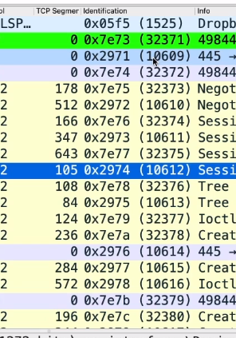
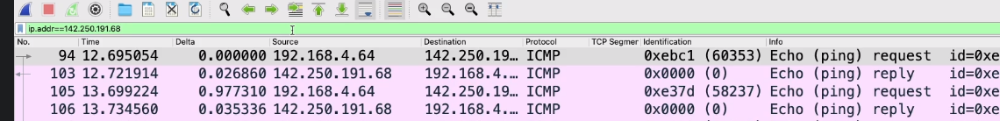
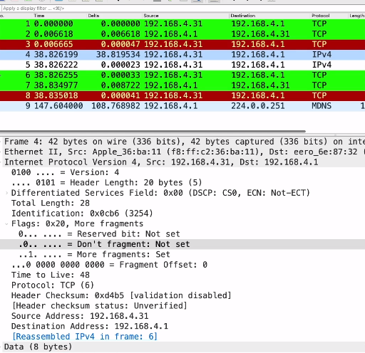
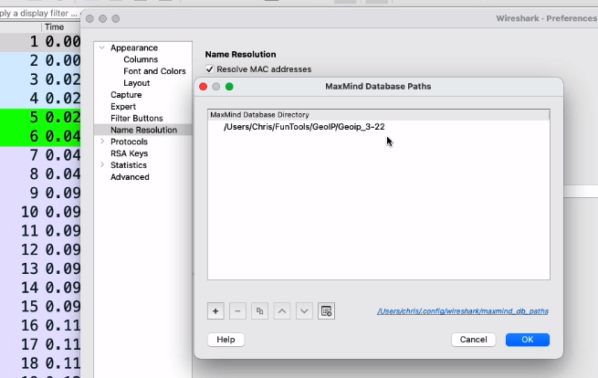

# Lab 4: Practical IP Analysis

## The IP ID

Let's check lab 4 file more.  

Add IP ID (Identification) as column. Check Packet nr 2, the source address is 192.168.1.10 and ID is 32371. The next ID is 32372, 32373 etc. They are growing by 1. Also you can see the opposite direction: 10609, 10610 etc. From the client site, he's talking only to server, if server is talking back to client and you will see if ID is jumping, means that he's also talking to other devices and busy.

## TTL Field

Ping Google on your machine (command line), and check traffic on Wireshark. Filter with your IP.

Check any packet from your IP to External IP, Delta time will be almost the same time.  
Keep in mind that the starting TTL values are going to be 64, 128, and 255.  
They don't take whoever sent this doesn't take my number and just copy it back to me, right?

My number started at 64, you can see my IP stack is using 64 to begin with but that server coming back to me is using 128 or by the time it gets to me, it's 128.  
But if it started at 128 then it went through 10 routers, and then I captured it.  
So this is a great way to get a good ballpark idea of how far away a station is.

But notice, while we're here take a look at that identification number.  
You can see the ID number is zero. So we're starting to see that nowadays with servers. Some of them just aren't using the IP ID. So they'll just have all zeros because they don't want to be fingerprinted.  
You notice with the ICMP packets, the ping requests and replies, or the requests are coming from me.

You can see here that my IP ID is jumping around 60,000, 58,000, 11,000.  
I'm not using a consistently counting IP ID.

So again, that's more information for me to know on this machine. I'm starting my TTL at 64, I can learn both my network latency, my network round trip time and I get an idea as far as TTL how far away that other device is.

  
  
What means TTL? Ask ChatGPT, if you don't remember.

## How IP Fragmentation Works

IP, from its inception, was designed to allow packets to be broken up along the way if necessary.

That meant that if we went across a router that had a low maximum transmission unit, that router would be able to break up the datagram and send those fragments along the way, and allow the endpoint, the final endpoint, to be able to reassemble them.

Let's go ahead and take a look at how this works with Wireshark, and what to look out for on the wire.  
Let's just look at how I can generate some large frames.

And this is mostly so you can try this on your own PC for testing. So ping yourself.

So, that endpoint is alive. If you're on Windows, you can do dash + L, which sends it the length switch.

What that does is, it tells my system, I want to send a ping that's 1,600 bytes long.  

I'm actually gonna go over to Wireshark. I'm just going to start a new capture.

And let's find out what happens on the wire. All right, so I'm just going to up arrow and I'm gonna do again, dash -l, 1,600.  
And 1,608 bytes is coming back.  
Let's just do a stop.  
 Or take 
Open IP fragmentation pcap file. Remove the TCP column and add the Length back. Filter ip.addr==192.168.4.1  

****

Total Length: 1500, Flags: More fragments: Set  
Let's check how chunks are made:

So this is what happened. The interface went, "Whoa, I gotta chop this up first." So it sent out the first one, and it sent out the second one, and both had the same IP ID.

If a router had done this along the path, then basically the same thing would've happened.

It would've taken this big packet that came in, it would've chopped it up, sent the first one along its way, the residual one back in a new packet with the same IP ID, and sent it along its way.

This is how an endpoint, the receiver, the ultimate receiver on the other side, is the one that reassembles these fragments.  
It's not the next router, or the next router after that.

The endpoint actually goes, "Oh, okay, here's two fragments, and the fragmentation flags are telling me how to put it back together, and I see the same IP ID. Good, I can glue them back together and then I can send them up the stack to TCP or to whatever it was, the application that was actually using this.  

Fragmentation happens when I'm sending an IP packet that is larger than the maximum transmission unit.

****

## IP flags

So here in the IP header, if you take a look at that first packet, the don't fragment bit is not set.  
So this means the endpoint is telling the network: Hey if you have to break this up, go ahead. I don't mind, you can do so. But if this was absolutely set, if an endpoint that's transmitting the data flags this, it says there's one here, that's telling the network not to mess with this packet. Do not break it up.

****  
**So what happens in that case, if I send a larger packet than an interface is able to transmit, but I have the do not fragment bit set, well, what's gonna happen then is that router is going to drop that packet because it can't forward it on, it's larger than the MTU, and then it's gonna send an ICMP message back to the original sender saying: Hey, I wanted to send this out the wire, but the do not fragment bit was set.**

## Suspect Scan Activity

Open the next "suspect_scan_activity.pcapng" file 

So, we haven't yet talked about too much about the TCP handshake and how that works.  
So here we have the SYN, SYN-ACK, and then a reset.  
Look at this next conversation.  
So, here we have, notice the length is really small, 42. Take a look at fragmented IP protocol.  
Let's take a look at packet number four.  
And if you come down here, this is a small packet.  

I mean, the total length is 28 bytes. And what this is saying is "more fragment" is set.  
So, basically, out of the total length 20 of those bytes is my IP header itself.  
So, that means I'm only encapsulating eight bytes.  
So, keep in mind, usually when there's a TCP SYN the initial packet, at least with an Nmap scan it's gonna be around 24 bytes or so.  
So, here's the first eight bytes.

Now "more fragments" is set. The fragment offset is zero.  
Alright, let's go ahead and go to packet number five. Okay, so again, 28 bytes. But, encapsulated is only eight. So, more fragments are coming after this.  
This one begins at eight. So, your first eight was zero to seven. This is gonna be eight to 15.  
  
And then the final packet, let's take a look at packet six. "More fragments" is not set.  
So, this is the final one. And this one begins at 16 and then takes us up to 23. So, that's our 24 bytes total when we glue these eight-byte fragments together.

We can notice that our identification number is exactly the same. And, also, keep your eye open for this, too, in Wireshark.

You see these dots?

What this means is that all of this was reassembled.  

Now, in the final packet (packet 6), this is where we do reassemble everything.  
That's why that green line packet number six is a TCP SYN.  
That's where Wireshark does this for us. It actually does that reassembly and presents it as if it was one packet.

So, the final packet is usually the one that's shown as the complete one.

****

**Now, in some cases for cybersecurity, this might be how an attacker tries to enumerate a system or try to sneak by an IDS or a firewall by fragmenting the data.**  
**Sometimes those kinds of systems don't check for fragments or allow fragments to kind of slip by. So, if you do see this kind of behavior that might be something that you wanna investigate.**

## Look at IPv6

Check the next pcap file: **Look at IPv6.pcapng **

All right, so here we can see that this station was going out and taking a look for Wireshark.org.

Okay, so notice that this happened over v4. So we did a DNS lookup over v4 and not to get too deep in the weeds in DNS just yet, but here we're requesting an A record.  
Let's go ahead and come down to DNS. DNS is over UDP, and if we come down to our question in the query, we are asking for a Type A record. Now, that's just a standard IPv4 host address.  
So we're saying, hey, V4 DNS server, give us a V4 address for Wireshark.org.  

So that comes, if you take a look over here with Wireshark, we can see the request and the reply.  
Request, reply, there's that visual arrow representation of the request and reply with DNS.

Okay, but right after that, check out how this is a little bit different. This next request, we fired these 30 microseconds between those two DNS queries. Okay, so this time though, we're asking for a quadruple A record. That's an IPv6 address, and we did hear back. We got a response, let's come down to packet number four. And in the answers, the DNS server came back in 24 milliseconds and said, hey, I got Wireshark.org.

We got a bunch of different addresses

  
So if we go ahead and then look at what the client did next. The client didn't use v4, he went ahead and said, hey, I'm gonna use v6. So let's take a look at packet number five.  
Welcome to IP version six, which in addition to a much larger IP address, as I'm sure you knew, there also quite a few other differences.  
  
Okay, so first of all, we're gonna take a look at packet five. Let's go ahead and take a look at our ethernet two. So this is the first time we're seeing 86dd in our packets unless you're used to working with v6 in your environment.   
If you come down, take a look at the IP header. Now, first of all, go ahead and just grab  
on the global label there. So IPv6, that whole layer. And if we come over to our hexadecimal,  
you can see how much more data it takes for the v6 header.  
So instead of a 20-byte header, it's really a 40-byte header that we have here for IPv6.  

Now we go straight to the traffic class. So this is almost like that DiffServ tag.

So how should this data be handled? Is it urgent? Does it have high priority? How should this be treated on the wire?

Next, we have a flow label. This is new for v6. So what this does is it allows a sender to denote if a stream of packets is in the same flow. And usually, that's gonna be, it's like a 3-tuple, that's what we call it, both IP addresses. So both IPv6 addresses, and then this flow label. Really, that has nothing to do with ordering or QoS, but really what it does is allows infrastructure devices to treat all of those packets as a flow.

As they see it come in, they see the flow label, they could route it more efficiently or they could send it in a different path. So it just allows a sender to take that entire stream and treat that as an individual flow in that direction.

All right, payload length. How much data are we actually encompassing within this IPv6 packet?

Next header, we're used to seeing that with the protocol identification field in v4.

Now, here it is in v6. So, the next header, is what's coming next as far as a protocol.

Hop limit.

So TTL, so doesn't this make a whole lot more sense? I never really did like the name of TTL, time to live, because it's not a function of time, it's a function of hops, right?

So that was fixed in v6 and then after that, we have source and destination address.

## Configuring Wireshark to Find GeoIP Locations

Now we can do GeoIP location, this works both for IPv4 and for IPv6.  
In pcap, if I take a look at just that first packet, that first IPv6 packet, probably noticed this from the previous file, if I come down to the bottom of the IP header, I can see that I have Source GeoIP and Destination GeoIP.  
  
So this is actual geolocation information about these IP addresses.  
So how do I do that? Well, first you have to download the GeoIP databases from MaxMind ([GeoLite2 Free Geolocation Data | MaxMind Developer Portal](https://dev.maxmind.com/geoip/geolite2-free-geolocation-data?lang=en))

So let me just show you a little bit more about that. Now this is to a site called MaxMind.  
Now what they do is they create a database, that it's a static database. So anytime you have an IP, it can do a lookup and it can give you things like city, country, autonomous system number, and also, where possible, we can get latitude and longitude. 

You can get GeoDB files for import (the most new ones usually you can take from site)  
Wireshark-> Preferences-> Name Resolution->  

## Analyzing a DDoS Attack with GeoIP

Open [strangescan.pcapng](./pcapng%20files/strangescan.pcapng) file, we will use GeoIP databases that you just installed.

All right, so this is exactly as it sounds it was a strange scan.

If you look at the IP addresses and the source IP column, tons of different IPs coming in from tons of different locations.  
But since we have the GeoIP databases, let's go and click one of those packets  
and I'm going to expand IP.  
And down here I can see where, what country it came from, what was the city, if that's available, and also the autonomous system number.  
  
Now wouldn't it be nice to see this at a high level?  
Like, see all of them in a list? Well, let's go ahead and go up to statistics.  
I'm gonna come down here to two endpoints and notice with the endpoints, all of the local addresses, so addresses that are in the 10 space, 192.168, 172.16, they're not gonna have a GeoIP lookup.

But anything outside of that should. So if I scroll down, now start to see the different countries and cities, and autonomous system numbers that we see here in our list.  
We have coming in from all over the place. Right, and keep in mind, I'm in the IP tab.  
You've got United States, Ashburn, if I keep scrolling, you got UK.  
There's quite a few other different countries in here, Croatia, Germany, Slovenia, Russia.  
So there's quite a few different ones coming in.  

In fact, I can come in down here to map and I can go open in browser.  

And what this will do is it will open up on my browser and it will drop a pin on the location that that address is coming from. Now it's possible that these addresses are spoofed, in fact, they are spoofed, several of them are.  
This was a real scan, but the scanner was using a scan tool that was spoofing the source address.  
However, in a real environment, a real scan, if it's not spoofed, then we can see from all over the world where these are coming from. And if we start to go in a little closer into some of these locations, and when you click on one of those dots or one of those big circles, it'll show you all the different addresses that it sees coming from that latitude and longitude.  
  
While we're here, also something we can do. I'm just gonna take one of these packets here, I'm gonna do a apply as filter selected and then apply that as a filter. I'm gonna close. What I wanna do here is I just picked one packet coming in from Russia, and if I come down here to the source IP, this is where I could say, okay, source or destination, GeoIP, ISO, two letter country code.  
Let's right click that.
And we're gonna say prepare is filter selected, so you see up at the top.  
So IP, GeoIP, country_ISO equals equals RU is the country code for Russia.  
I can now enter that as a filter, and I can filter on any addresses coming from that particular country. 

  
