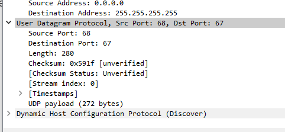
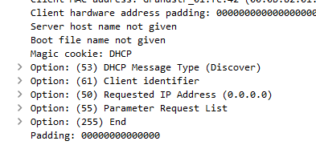

# Lab 5 - Practical UDP and TCP Analysis

In this lab, we'll explore the fundamentals of UDP and TCP protocols through practical packet analysis. We'll examine DHCP, DNS, and TCP connections to gain a deeper understanding of how these protocols function, and then apply this knowledge to determine whether IP addresses in a scan are legitimate or spoofed.

## The UDP Header Explained

Let's begin by analyzing how UDP works in the context of DHCP. Open the trace file to see the DHCP process in action.


DHCP follows a four-packet exchange known as DORA (Discover, Offer, Request, Acknowledge). This process illustrates the simplicity and efficiency of UDP.

When a station connects to a network, it knows very little about itself - just its MAC address. It needs to discover network configuration through DHCP. This is why UDP is perfect for this initial bootstrapping process - there's no need for the overhead and complexity of a connection-oriented protocol like TCP when you're just starting out on the network.

The first packet is a broadcast since the client doesn't know who the DHCP server is:


Looking at the IP addresses, we see the source is 0.0.0.0 (unknown) and the destination is a broadcast to the entire subnet. This broadcast approach allows the DHCP client to reach any DHCP server without needing to know its address in advance - an elegant solution to the "chicken and egg" problem of needing an address to communicate but needing to communicate to get an address.

Examining the UDP header shows just how simple it is - only 8 bytes:


The UDP header contains just four elements:
- Source port (16 bits)
- Destination port (16 bits)
- Length (16 bits) - total length of the UDP header and data
- Checksum (16 bits) - optional error-checking field

This simplicity reflects UDP's design philosophy - no reliability mechanisms, no connection tracking, just simple data delivery. It's a "fire and forget" protocol that prioritizes speed and efficiency over guaranteed delivery. The application layer must handle any needed reliability.



For DHCP, we see the client using port 68 and the server using port 67. These standardized port numbers allow clients and servers to find each other without prior coordination. UDP doesn't care about the payload content - it's just transporting 272 bytes of data without any concern for what that data contains or whether it arrives successfully.

## How DHCP Works

Let's analyze the DHCP process in detail to understand how this UDP-based service operates:

**Packet 1: DHCP Discover**
The client doesn't have an IP address yet, so it's all zeros. The only identifier it has is its MAC address:


This is like shouting into the void: "Hello? Is there a DHCP server out there? I'm new here and need an address. Here's my MAC if you want to talk to me!" The client has no idea who will answer or what address it will receive.

The client also requests various configuration options:



DHCP is extensible through its options field, allowing clients to request specific configuration parameters beyond just an IP address. This flexibility has helped DHCP evolve over time to support changing network requirements.

The requested IP address is 0.0.0.0 since the client doesn't know what to ask for yet. If it had previously been assigned an address, it might request that same address again:


This feature helps maintain stable addressing even with dynamic allocation. If a client reconnects after a brief absence, it can often get the same address back, which helps with services that might depend on that address.

In the parameter request list, the client asks for:
- Subnet mask (option 1)
- Router/default gateway (option 3)
- Domain name server/DNS (option 6)
- Network time protocol server/NTP (option 42)


These parameters form the core configuration needed for effective network communication. The subnet mask defines the network boundaries, the router provides internet access, DNS enables name resolution, and NTP keeps the client's clock synchronized.

These are just requests - the server isn't required to provide all these parameters:


This optionality allows DHCP servers to be configured according to network policy. Some environments might not want to provide certain information via DHCP, or might want to force clients to use specific configurations.

**Packet 2: DHCP Offer**
The server responds with an offer, suggesting IP address 0.0.0.10 for the client:


The offer includes lease information:
- 30-minute renewal time
- 52-minute rebinding time
- 1-hour total lease time

These timers create a structured approach to address management. At 30 minutes, the client will try to renew with its current server. If unsuccessful by 52 minutes, it will broadcast to any DHCP server. If still unsuccessful by 60 minutes, it will lose its address and start over. This tiered approach balances stability with the need to reclaim unused addresses.

**Packet 3: DHCP Request**
The client responds 69 milliseconds later with a request:


Despite receiving an offer, the client still broadcasts its request rather than unicasting to the specific server. This serves two purposes: it informs all DHCP servers that the client has chosen an offer (allowing others to withdraw theirs), and it maintains compatibility with early DHCP implementations.

The client formally requests the offered IP address:


It also reminds the server that it still needs router, DNS, and NTP information. This persistence ensures the client gets all the configuration it needs for proper network operation.

**Packet 4: DHCP Acknowledge**
The server acknowledges the request and confirms the lease information:


Interestingly, we never received gateway, DNS, or NTP information, which could cause connectivity issues for the client. This is a common troubleshooting point in DHCP - a client might get an address but lack the additional configuration needed for full network functionality.

This entire exchange occurred over UDP with no connection establishment or acknowledgments - just packets sent with the hope that they reach their destination. If a packet is lost, DHCP relies on timeouts and retransmissions at the application layer rather than transport-layer reliability mechanisms.

## Analyzing DNS

Now let's examine Domain Name System (DNS), another crucial service that uses UDP.

DNS acts as the internet's phonebook, converting names to IP addresses and vice versa. It's one of the most fundamental services in networking, enabling us to use memorable domain names instead of numeric IP addresses.

Let's download the DNS PCAP file:


After filtering for DNS traffic, we see numerous queries related to Udemy:


This is normal behavior when visiting a website - multiple DNS queries are often needed to load various resources. Modern websites pull content from numerous sources, each requiring DNS resolution. This pattern of multiple parallel DNS lookups is characteristic of web browsing.


Looking at packet 1, we see a request for www.udemy.com's A record (IPv4 address). DNS uses different record types for different purposes - A for IPv4 addresses, AAAA for IPv6, MX for mail servers, TXT for text information, etc. Expanding the DNS section reveals this is a query message.

Wireshark can correlate requests and responses to show complete DNS conversations. By right-clicking and selecting Conversation Filter > UDP, we can isolate specific DNS exchanges:


We can also filter for slow DNS responses using expressions like "dns.time > 0.5" to identify performance issues. DNS performance is critical for overall browsing speed since it's usually the first step in connecting to any service.

DNS typically uses UDP for efficiency, but will fall back to TCP for responses larger than 512 bytes (like those containing many records or DNSSEC information). This hybrid approach balances performance with functionality.

# Practical TCP Analysis

## The Handshake

Now let's examine how TCP connections are established through the three-way handshake:


[TCP handshake - MDN Web Docs Glossary: Definitions of Web-related terms | MDN (mozilla.org)](https://developer.mozilla.org/en-US/docs/Glossary/TCP_handshake)

The TCP handshake is one of the most fundamental processes in networking, establishing the parameters for a reliable connection between two endpoints. Unlike UDP's connectionless approach, TCP invests in this initial setup to enable reliable, ordered delivery.


The Initial Sequence Number (ISN) is crucial - it's where the client will begin counting data bytes. With each byte sent, this sequence number increments by one. This sequencing allows the receiver to reassemble data in the correct order and detect missing segments.

Initial Sequence Numbers are typically pseudo-random for security reasons. Using predictable sequence numbers could allow attackers to inject malicious packets into a connection (this was a vulnerability in early TCP implementations).

In the SYN-ACK, the server acknowledges the client's sequence number by incrementing it by one (648 → 649) and returning it in the ACK field. This increment is a key point - TCP acknowledges the sequence number of the next byte it expects to receive, not the last byte it received. This approach simplifies recovery from lost packets.

In the final ACK, the client does the same with the server's sequence number (6359 → 6360). This synchronization is why it's called a SYN. At this point, both sides have agreed on starting sequence numbers and are ready to exchange data.


The handshake also exchanges flags that indicate packet types and functions. TCP flags are single-bit fields in the TCP header that modify how the packet should be interpreted:

- SYN: Synchronize sequence numbers (start connection)
- ACK: Acknowledge received data
- FIN: Finish connection (graceful closure)
- RST: Reset connection (abrupt closure)
- PSH: Push data to the application without buffering
- URG: Urgent data present

These flags allow TCP to manage the connection state machine efficiently. Multiple flags can be set simultaneously (like SYN-ACK) to convey complex state transitions.

## Analyzing TCP Options

The window value advertises how much unacknowledged data can be sent at once:


In this example, 1.10 tells 10.0.0.2 it can send up to 64240 bytes in a burst. This flow control mechanism prevents a fast sender from overwhelming a slow receiver. The window size can change throughout the connection as buffer availability changes.

TCP options extend the protocol's capabilities beyond its original design:


[https://www.geeksforgeeks.org/options-field-in-tcp-header/](https://www.geeksforgeeks.org/options-field-in-tcp-header/)

TCP options include critical enhancements like:

- Maximum Segment Size (MSS): Optimizes segment size for the network path
- Window Scale: Allows window sizes larger than 65,535 bytes
- Selective Acknowledgment (SACK): Improves recovery from multiple packet losses
- Timestamps: Enables more accurate RTT calculation and protects against wrapped sequence numbers

These options are typically negotiated during the handshake, allowing connections to be optimized for specific network conditions.

## Let's Shut it Down - FINs vs Resets

TCP connections can terminate in two ways:
1. Gracefully with FIN flags (four-way handshake)
2. Abruptly with RST (reset) flags

In the Intro PCAP, packet #70 shows a graceful shutdown:


A graceful shutdown involves each side independently closing its side of the connection with a FIN packet. This allows any in-flight data to be delivered before the connection fully closes. The process is:

1. Client sends FIN
2. Server sends ACK (acknowledging the FIN)
3. Server sends FIN (when ready to close its side)
4. Client sends ACK

This approach ensures that all data has been successfully transferred before the connection terminates.

We can filter for resets using "tcp.flags.reset==1":


Resets provide valuable information about network behavior. If you send SYN packets and receive:
- No response: Possible firewall blocking
- RST responses: You're reaching an actual endpoint that's refusing the connection


A reset occurs when something unexpected happens, like a connection attempt to a closed port, packets arriving for a connection that no longer exists, or when an application wants to immediately terminate a connection without the overhead of the four-way handshake.

Resets are common in scanning activities and can be used by defenders to identify reconnaissance. When analyzing potential intrusions, patterns of RST packets can reveal scanning attempts.

## Lab 5 Assignment: Scanning Analysis

For the assignment, we need to analyze a scan to determine if the source IPs are legitimate or spoofed. Here are detailed instructions on how to approach this analysis:

### How to Count Unique IP Hosts
1. Open the Statistics menu in Wireshark
2. Select "Endpoints"
3. Go to the IPv4 tab
4. The count of rows shows the number of unique IP hosts
5. Alternatively, use the display filter: `ip.addr`, then right-click on any IP address and select "Apply as Column"

The number of hosts involved can give us insight into the scale of the scanning activity. A large number of source IPs targeting a small number of destinations often indicates a distributed scan.

### Finding the Top IP Conversation
1. Go to Statistics > Conversations
2. Click on the IPv4 tab
3. Click on the "Packets" column header to sort by packet count (highest to lowest)
4. The top row shows the conversation with the most packets
5. You can also use: Statistics > Conversation List > IPv4 to see this information

The distribution of packets across conversations can reveal focused targeting. If one conversation dominates the capture, it might indicate a more targeted attack rather than broad reconnaissance.

### Determining Country of Origin
1. Enable the GeoIP database in Wireshark (if not already enabled):
   - Edit > Preferences > Name Resolution
   - Check "Enable network object name resolution"
   - Check "Enable GeoIP lookups"
2. Add a column for country information:
   - Right-click on any column header > Column Preferences
   - Click "+" to add a new column
   - Title: "Country"
   - Type: "Custom"
   - Fields: "ip.geoip.country"
3. Filter for the specific IP: `ip.addr == 62.189.238.32`
4. Look at the Country column

Geographic origin can provide context about the source of traffic. Certain countries are more commonly associated with scanning or malicious activity, though this should never be the sole basis for assessment.

### Filtering for Turkey Traffic
1. Use this display filter: `ip.geoip.country_iso == "TR"`
2. The packet list will show only traffic from Turkish IP addresses
3. Check the packet count in the status bar at the bottom of Wireshark

Examining traffic from specific regions can help identify patterns in scanning behavior. If multiple IPs from the same country show similar scanning patterns, they might be part of a coordinated effort.

### Checking TTL Values
1. Add TTL as a column:
   - Right-click on any column header > Column Preferences
   - Click "+" to add a new column
   - Title: "TTL"
   - Type: "Custom" 
   - Fields: "ip.ttl"
2. For specific packets, click on them and expand the "Internet Protocol" section to see the TTL value
3. For packet 1, look for this field in the packet details pane

TTL (Time-to-Live) values are crucial for spoofing detection. Each operating system typically uses specific initial TTL values (Windows: 128, Linux: 64, etc.), and these values decrease by one at each router hop. Packets allegedly from the same source should have consistent TTL values unless the network path is changing.

### Finding IP Identification Numbers
1. Add IP ID as a column:
   - Right-click on any column header > Column Preferences
   - Click "+" to add a new column
   - Title: "IP ID"
   - Type: "Custom"
   - Fields: "ip.id"
2. For specific packets like #1 and #7, click on them and expand the "Internet Protocol" section
3. Look for "Identification: 0x[some hex value] ([decimal value])"

The IP Identification field is another key indicator for spoofing. Most operating systems increment this value sequentially for each packet sent. If you see packets supposedly from the same source with non-sequential or duplicate IP IDs, this strongly suggests spoofing.

### Filtering for Subnet Traffic
1. To filter for the 212.252.0.0/16 subnet:
   - Use this display filter: `ip.src == 212.252.0.0/16`
2. To filter for outgoing traffic only:
   - Use: `ip.src == 212.252.0.0/16`
3. To add TTL and filter:
   - First add the TTL column as described above
   - Then apply the filter: `ip.src == 212.252.0.0/16`

Analyzing traffic from specific subnets can reveal patterns that might not be apparent when looking at individual IPs. Genuine traffic from a subnet should show consistent characteristics, while spoofed traffic often shows inconsistencies.

### Checking for Spoofed IPs
Look for these inconsistencies which may indicate spoofing:

1. **TTL Analysis**:
   - Filter for the subnet: `ip.src == 212.252.0.0/16`
   - Examine TTL values from the same subnet
   - Legitimate traffic from the same network segment should have similar TTL values
   - Large variations in TTL from the same subnet suggest spoofing

When the same source IP shows wildly different TTL values, it's unlikely to be legitimate. The network path might change slightly over time, causing minor TTL variations (±1-2), but large jumps are suspicious.

2. **IP ID Analysis**:
   - Filter for the subnet: `ip.src == 212.252.0.0/16`
   - Sort by the IP ID column
   - Look for patterns:
     - Sequential IP IDs from the same source suggest legitimate traffic
     - Random or static IP IDs from the same source suggest spoofing
     - Duplicate IP IDs from the same source in a short timeframe suggest spoofing

The IP ID field should increment in a predictable pattern for legitimate traffic. Finding the same IP ID value used repeatedly or completely random patterns is a strong indicator of spoofing.

3. **Scanning Behavior**:
   - Check for SYN packets with no follow-up traffic: `tcp.flags.syn == 1 and tcp.flags.ack == 0`
   - See if responses to these SYNs (SYN-ACKs) are acknowledged
   - Lack of ACK responses to SYN-ACKs suggests the source IP might be spoofed

In spoofed scanning, the attacker often doesn't receive the SYN-ACK responses (which go to the spoofed address), so they can't complete the handshake. This results in many orphaned SYN packets with no follow-up.

4. **Geographic Anomalies**:
   - Check if traffic from the same subnet is coming from different countries
   - Use: `ip.src == 212.252.0.0/16` and look at the Country column

IP addresses from the same subnet should generally be located in the same geographic region. Finding IPs from the same subnet but different countries is a strong indicator of spoofing.

## Additional Tips and Techniques for Network Analysis

### Understanding IP ID as a Spoofing Indicator

The IP Identification field (IP ID) is especially useful for detecting spoofed traffic because:

1. **Operating System Patterns**: Different operating systems handle IP ID generation differently:
   - Windows typically uses a global counter that increments sequentially for all connections
   - Linux often uses separate counters per destination
   - Some implementations use random IP IDs

These different implementation approaches create distinct patterns that can be recognized. Deviations from these expected patterns are a strong indicator of spoofing.

2. **When analyzing the IP ID field**:
   - If you see the same IP ID value repeated from the same source across multiple packets, this is highly suspicious
   - If you see completely non-sequential values from what appears to be the same host, this could indicate spoofing
   - Remember that fragments of the same packet share the same IP ID - this is normal and not an indicator of spoofing

The IP ID field is primarily used for reassembling fragmented packets, but its predictable behavior makes it valuable for detecting spoofing.

### Advanced TTL Analysis

TTL values can reveal more than just spoofing:

1. **Initial TTL Values by OS**:
   - Windows: Typically 128
   - Linux/Unix: Often 64
   - Routers: Commonly 255

These standard values allow you to "fingerprint" the operating system of the source device and detect inconsistencies that might indicate spoofing.

2. **Distance Calculation**:
   - The difference between the expected initial TTL and the observed TTL can tell you approximately how many hops away the source is
   - Formula: Hops = (Initial TTL - Observed TTL)
   - Example: If you see TTL=57 from a Linux host (initial TTL 64), the packet traveled through approximately 7 routers

This hop count estimation can help verify if the geographic location matches the expected network distance.

3. **TTL Expiration Attacks**:
   - Some attacks deliberately use low TTL values to make packets expire at specific network points
   - If you see many packets with very low TTL values (1-5), this could indicate a TTL-based attack

These specialized attacks attempt to manipulate packet delivery in a way that might evade certain security controls.

### Capture and Display Filters for SYN Scanning

To specifically identify SYN scanning activity:

1. **Basic SYN scan filter**:
   ```
   tcp.flags.syn == 1 and tcp.flags.ack == 0 and tcp.window_size > 0
   ```

This filter captures the classic signature of a SYN scan - connection attempts without the intention to complete them.

2. **Filter for SYN packets to many different ports**:
   ```
   tcp.flags.syn == 1 and tcp.flags.ack == 0 and tcp.dport > 1023
   ```

Scanning across many high ports is a common reconnaissance technique to identify available services.

3. **Filter for high rate SYN scanning** (add a time column to see this):
   ```
   tcp.flags.syn == 1 and tcp.flags.ack == 0 and tcp.window_size > 0
   ```
   Then sort by time to see how rapidly SYNs are being sent

Automated scanning tools typically send packets at a much higher rate than human-initiated connections.

### Wireshark Time Analysis Techniques

Make use of Wireshark's time display features:

1. **Change time display format**:
   - View > Time Display Format > Seconds Since Previous Displayed Packet
   - This helps identify scanning patterns based on timing

Scanning tools often generate traffic with unnaturally consistent timing patterns that stand out from normal human activity.

2. **Add delta time columns**:
   - Right-click on column header > Column Preferences
   - Add a column with type "Delta time displayed"
   - This shows time between packets, helping identify automated scanning (which often has very consistent timing)

The regularity of packet timing can be a key indicator of automated scanning versus legitimate traffic.

3. **Create I/O graphs for scan detection**:
   - Statistics > I/O Graph
   - Y-Axis: Packets/sec
   - Filter: `tcp.flags.syn == 1 and tcp.flags.ack == 0`
   - This visualizes scanning activity over time

Visualization can reveal patterns that might not be obvious when looking at individual packets.

By incorporating these additional techniques into your analysis, you'll be able to more confidently determine whether the traffic in your PCAP file represents legitimate communication or spoofed scanning activity. Remember that real-world attackers often combine techniques to evade detection, so using multiple indicators together provides the strongest evidence.

When completing the lab assignment questions, apply these analytical techniques systematically to determine whether the scanning traffic in your PCAP is using legitimate or spoofed source addresses. Pay special attention to the consistency of TTL values and IP ID patterns from the same subnet, as these are the strongest indicators of IP spoofi